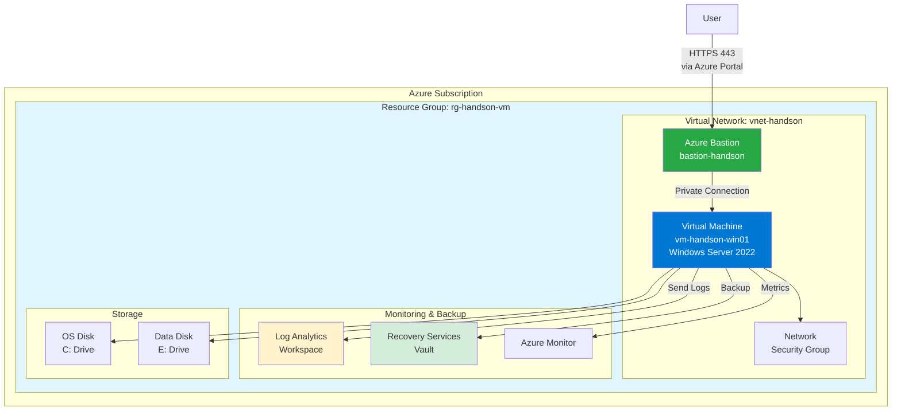
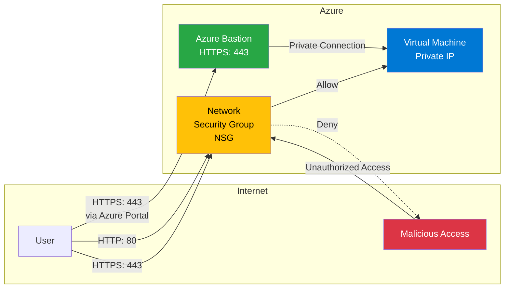
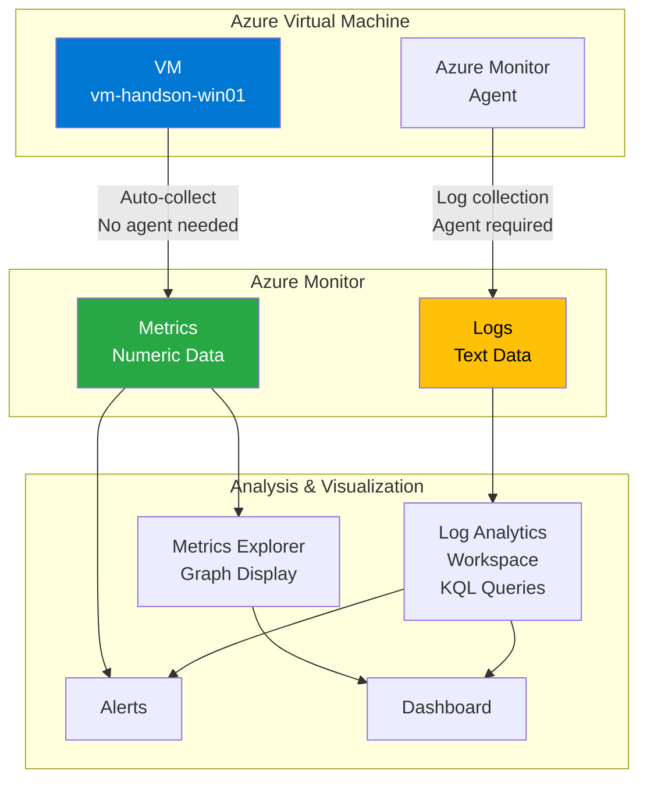
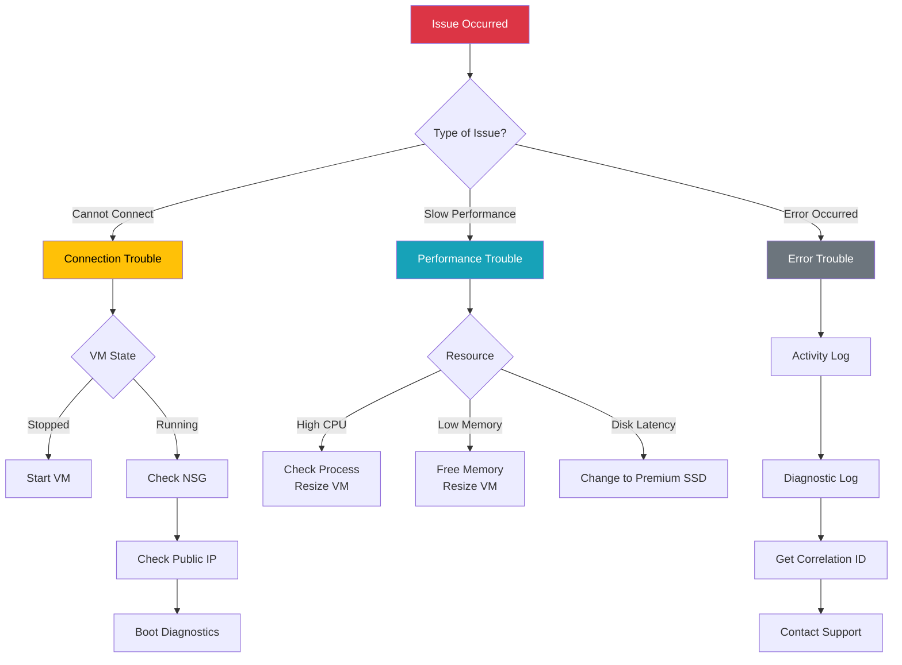

# Azure Hands-On Lab Guide
## Virtual Machine Management Fundamentals

---

## 📑 Table of Contents

1. [Prerequisites](#prerequisites)
2. [① Server Setup (Windows Server VM Creation)](#-server-setup-windows-server-vm-creation)
3. [② Server Communication Control Settings (Network Security Group)](#-server-communication-control-settings-network-security-group)
4. [③ Backup & Restore](#-backup--restore)
5. [④ Resource Scaling](#-resource-scaling)
6. [⑤ Server Load Monitoring](#-server-load-monitoring)
7. [⑥ Troubleshooting](#-troubleshooting)
8. [Cleanup After Hands-On](#cleanup-after-hands-on)
9. [Reference Resources](#reference-resources)
10. [Summary](#summary)
11. [(Reference) Using IaC](#reference-using-iac)

---

## Prerequisites

- Azure subscription already created
- Access to Azure Portal
- Required time: Approximately 3-4 hours

### Overall Hands-On Architecture



> **What is Azure Bastion?**
> - A service that enables secure VM connections without exposing public IP addresses
> - No need to expose RDP port (3389) externally
> - Connect via Azure Portal using HTTPS (443) only
> - Protects VMs from DDoS attacks and brute-force attacks

---

## ① Server Setup (Windows Server VM Creation)

### Learning Objectives
- Understand the basic concepts of Azure Virtual Machines
- Create and start a Windows Server VM

### Lab Instructions

#### 1-1. Create Virtual Machine

1. **Sign in to Azure Portal**
   - https://portal.azure.com

2. **Create Resource Group**
   - Search for "Resource groups"
   - Click "+ Create"
   - Resource group name: `rg-handson-vm`
   - Region: `Japan East`
   - Click "Review + create" → "Create"

3. **Create Virtual Machine**
   - Search for "Virtual machines"
   - Click "+ Create" → "Azure virtual machine"

4. **Basic Settings**
   - **Project details**
     - Subscription: Your subscription
     - Resource group: `rg-handson-vm`
   
   - **Instance details**
     - Virtual machine name: `vm-handson-win01`
     - Region: `Japan East`
     - Availability options: `No infrastructure redundancy required`
     - Security type: `Standard`
     - Image: `Windows Server 2022 Datacenter - x64 Gen2`
     - Size: `Standard_B2s (2 vcpu, 4 GiB memory)`
   
   - **Administrator account**
     - Username: `azureuser`
     - Password: Set a complex password (record it)
   
   - **Inbound port rules**
     - Public inbound ports: `None` (connect via Bastion)

5. **Disk Settings**
   - Click "Next: Disks"
   - OS disk type: `Standard SSD (locally-redundant storage)`
   - Keep default settings

6. **Network Settings**
   - Click "Next: Networking"
   - Virtual network: Create new (default)
   - Subnet: default
   - **Public IP: `None`** (access via Bastion)
   - Keep default settings

7. **Review and Create**
   - Click "Review + create"
   - After validation passes, click "Create"
   - Wait a few minutes for deployment to complete

#### 1-2. Azure Bastion Setup

1. **Create Bastion**
   - On the VM "Overview" page, select "Connect" → "Bastion"
   - Click "Use Azure Bastion"
   
2. **Bastion Configuration**
   - Name: `bastion-handson`
   - Tier: `Basic` (standard features) or `Standard` (advanced features)
   - Virtual network: `vnet-handson` (existing VNet)
   - New subnet name: `AzureBastionSubnet` (auto-created)
     - Address range: `10.0.1.0/26` (minimum /26 required)
   - Public IP address: Create new
     - Name: `pip-bastion-handson`
   
3. **Execute Creation**
   - Click "Create"
   - Wait approximately 10 minutes for deployment to complete

> **Benefits of Azure Bastion**:
> - Improved security without requiring public IP for VM
> - No need to expose RDP port (3389) externally
> - Connect via Azure Portal using HTTPS (443) only
> - Protects VM from DDoS/brute-force attacks

#### 1-3. Connect to Virtual Machine

1. **Connect to VM via Bastion**
   - Select "Connect" → "Bastion" tab on the VM
   - Authentication type: `Password`
   - Username: `azureuser`
   - Password: The password set during creation
   - Click "Connect"

2. **Verify Connection**
   - A new tab opens in the browser displaying the VM desktop
   - Server Manager starts automatically

> **Tip**: Bastion connection is browser-based, so no RDP client is needed on the client machine

### Verification Points
- [ ] VM created successfully
- [ ] Azure Bastion deployed successfully
- [ ] Can connect to VM via Bastion
- [ ] VM status is "Running"
- [ ] Can log in via RDP

---

## ② Server Communication Control Settings (Network Security Group)

### Learning Objectives
- Understand the role of Network Security Groups (NSG)
- Configure inbound and outbound rules

### How NSG Works



> **Role of NSG when using Bastion**:
> - Management access (RDP/SSH) is done via Bastion, so no need to open RDP/SSH ports in NSG
> - NSG is primarily used to control application layer ports (HTTP/HTTPS, etc.)

### Lab Instructions

#### 2-1. Check Current NSG Settings

1. **Select "Networking" from VM Overview Page**
   - Click "Network settings" in the left menu

2. **Review Existing Rules**
   - Check inbound port rules
   - When using Bastion, verify that RDP/SSH ports are not open

#### 2-2. Add Rule to Allow HTTP Access

1. **Add Inbound Security Rule**
   - Click "Add inbound port rule"
   
   - **Configuration**
     - Source: `Any`
     - Source port ranges: `*`
     - Destination: `Any`
     - Service: `HTTP`
     - Destination port ranges: `80` (auto-filled)
     - Protocol: `TCP`
     - Action: `Allow`
     - Priority: `310`
     - Name: `Allow-HTTP`
   
   - Click "Add"

#### 2-3. Add Rule for HTTPS

1. **Click "Add inbound port rule" Again**
   - Service: `HTTPS`
   - Destination port ranges: `443`
   - Priority: `320`
   - Name: `Allow-HTTPS`
   - Click "Add"

#### 2-4. Review Outbound Rules

1. **Select Outbound Security Rules Tab**
   - Verify that all outbound traffic is allowed by default

> **Note**: RDP connections via Bastion are automatically allowed by Azure service tags, so no manual NSG rule addition is required.

### Verification Points
- [ ] HTTP (80) port is allowed
- [ ] HTTPS (443) port is allowed
- [ ] Confirmed that RDP/SSH ports are not exposed externally
- [ ] Understood the concept of priority

---

## ③ Backup & Restore

### Learning Objectives
- Understand how to configure Azure Backup
- Learn how to restore from backup

### Lab Instructions

#### 3-1. Create Recovery Services Vault

1. **Search for Recovery Services Vault**
   - Search for "Recovery Services vaults" in Azure Portal
   - Click "+ Create"

2. **Vault Configuration**
   - Resource group: `rg-handson-vm`
   - Vault name: `rsv-handson-backup`
   - Region: `Japan East`
   - Click "Review + create" → "Create"

#### 3-2. Enable VM Backup

1. **Return to VM Overview Page**
   - Open `vm-handson-win01`

2. **Backup Configuration**
   - Select "Backup" from the left menu
   - Click "Enable backup"

3. **Backup Policy Configuration**
   - Recovery Services vault: `rsv-handson-backup`
   - Backup policy: "Create new policy"
     - Policy name: `policy-daily-backup`
     - Backup schedule: Daily at 2:00 AM
     - Instant recovery snapshot retention: 2 days
     - Daily backup point retention: 7 days
   - Click "Enable"

#### 3-3. Run On-Demand Backup

1. **Execute Immediate Backup**
   - After backup is enabled, click "Backup now"
   - Recovery point retention deadline: 30 days
   - Click "OK"
   - Backup job starts (takes 10-20 minutes to complete)

2. **Monitor Backup Job**
   - Open Recovery Services vault (`rsv-handson-backup`)
   - Check status in "Backup jobs"

#### 3-4. File-Level Recovery (Test)

1. **Connect to VM via RDP and Create Test File**
   - Create `test-backup.txt` on C drive
   - Content: "This is a backup test file"

2. **Delete File**
   - Delete the created file and empty recycle bin

3. **Restore File**
   - In Azure Portal, select VM → "Backup"
   - Click "File Recovery"
   - Select recovery point
   - Click "Download Script"
   - Run script inside VM
   - Restore file from mounted drive

#### 3-5. Full VM Restore (Optional: Demo Only)

> **Note**: Actually restoring creates a new VM and incurs charges, so review the steps only

1. **Review Restore Options**
   - Recovery Services vault → "Backup items"
   - Click "Azure Virtual Machine"
   - Select the relevant VM
   - Click "Restore VM"
   
2. **Restore Options**
   - **Create new**: Create a new VM
   - **Replace existing**: Replace disks of existing VM
   - **Restore disks**: Restore disks only

### Verification Points
- [ ] Recovery Services vault created
- [ ] Backup completed successfully
- [ ] File-level recovery was successful
- [ ] Understood VM restore options

---

## ④ Resource Scaling

### Learning Objectives
- Understand how to resize VMs
- Learn how to resize disks and improve performance
- Understand the concept of scale-out

### Lab Instructions

#### 4-1. CPU/Memory Scaling (Vertical Scaling)

1. **Stop VM**
   - Click "Stop" on VM overview page
   - Click "Yes" to confirm
   - Wait until status becomes "Stopped (deallocated)"

2. **Change VM Size**
   - Select "Size" from left menu
   - Current size: `Standard_B2s (2 vcpu, 4 GiB)`
   - Select new size: `Standard_B2ms (2 vcpu, 8 GiB)`
   - Click "Resize"

3. **Start VM**
   - Click "Start"
   - Wait for startup to complete

4. **Verify Resource Change**
   - Connect via RDP
   - Check installed memory in Task Manager
   - Verify it has increased to 8GB

#### 4-2. Storage Scaling

##### Add Data Disk

1. **Add New Disk**
   - Select VM → "Disks"
   - Click "+ Create and attach a new disk"
   
   - **Configuration**
     - Disk name: `vm-handson-win01-datadisk01`
     - Source type: `None (empty disk)`
     - Size: `64 GiB (Premium SSD)`
     - Encryption: Default
   
   - Click "Save"

2. **Initialize Disk Inside VM**
   - Connect to VM via RDP
   - Open Server Manager
   - Go to "File and Storage Services" → "Disks"
   - Right-click new disk → "New Volume"
   - Follow wizard to format (Drive letter: E)

##### Improve Disk Performance

1. **Change Disk Type**
   - Select VM → "Disks"
   - Click OS disk
   - Select "Size + performance"
   - Change to `Premium SSD` (faster)
   - Click "Save"

2. **Expand Disk Size**
   - Click data disk
   - Select "Size + performance"
   - Change size to `128 GiB`
   - Click "Resize"

3. **Expand Volume Inside VM**
   - Connect to VM via RDP
   - Open Disk Management
   - Right-click E drive → "Extend Volume"
   - Follow wizard to extend

#### 4-3. Scale-Out (Increase VM Count)

##### Create Availability Set (Basic Understanding)

1. **Create Availability Set**
   - Search for "Availability sets"
   - Click "+ Create"
   - Resource group: `rg-handson-vm`
   - Name: `avset-handson`
   - Region: `Japan East`
   - Fault domains: `2`
   - Update domains: `5`
   - Click "Create"

##### Create Load Balancer (Concept Understanding)

> **Note**: Creating a second VM will incur charges, so we'll cover concepts only

1. **Understanding Load Balancer**
   - Distributes load across multiple VMs
   - Achieves high availability
   - Health check functionality

2. **Scale-Out Flow**
   - Create second VM (in same availability set)
   - Create load balancer
   - Add both VMs to backend pool
   - Configure load balancing rules

### Verification Points
- [ ] VM size changed and memory increased
- [ ] Data disk added
- [ ] Disk size expanded
- [ ] Understood scale-out concepts

---

## ⑤ Server Load Monitoring

### Learning Objectives
- Understand monitoring methods using Azure Monitor
- Learn the difference between metrics and logs
- Understand how to configure alerts

### Azure Monitor Overall Architecture



### Lab Instructions

#### 5-1. Check Metrics with Azure Monitor

1. **Display Metrics**
   - Select "Metrics" on VM overview page
   - Select from "Metric" dropdown
     - `Percentage CPU` (CPU usage)
     - `Available Memory Bytes` (available memory)
     - `Disk Read Bytes` (disk read)
     - `Disk Write Bytes` (disk write)
     - `Network In Total` (inbound network)
     - `Network Out Total` (outbound network)

2. **Change Time Range**
   - View in "Last 1 hour", "Last 24 hours", "Last 7 days"

3. **Display Multiple Metrics Simultaneously**
   - Click "+ Add metric"
   - Display CPU usage and memory simultaneously

#### 5-2. Enable VM Insights (Extended Monitoring)

1. **Enable Insights**
   - Select VM → "Insights"
   - Click "Enable"
   - Install Azure Monitor agent
   - Wait a few minutes for enablement

2. **Check Performance Dashboard**
   - Detailed CPU usage graphs
   - Memory usage
   - Disk IOPS
   - Network traffic

3. **Check Map Feature**
   - Select "Map" tab
   - Visualize VM dependencies
   - Check connected resources

#### 5-3. Execute Log Queries

> **Note: Difference between Azure Monitor Workspace and Log Analytics Workspace**
>
> | Item | Log Analytics Workspace | Azure Monitor Workspace |
> |------|------------------------|------------------------|
> | **Official Name** | Azure Monitor Logs | Azure Monitor managed service for Prometheus |
> | **Purpose** | Log data collection & analysis | Prometheus metrics collection & analysis |
> | **Data Format** | Logs (text-based) | Metrics (time-series data) |
> | **Query Language** | KQL (Kusto Query Language) | PromQL (Prometheus Query Language) |
> | **Main Target** | VMs, application logs, event logs | Kubernetes (AKS), container metrics |
> | **Table Examples** | Perf, Event, Syslog, Heartbeat | PrometheusMetrics |
> | **Tool Integration** | Azure Monitor, Log Analytics | Grafana, Prometheus |
> | **Use in This Hands-On** | ✅ Used (VM log analysis) | ❌ Not used |
>
> **Simply put:**
> - **Log Analytics Workspace**: Store & analyze VM and application "logs" (used in this hands-on)
> - **Azure Monitor Workspace**: Store & analyze Kubernetes etc. "metrics" in Prometheus format
>
> This hands-on uses **Log Analytics Workspace** as we're dealing with VM logs and performance counters.

1. **Create Log Analytics Workspace**
   - Search for "Log Analytics workspaces"
   - Click "+ Create"
   - Resource group: `rg-handson-vm`
   - Name: `law-handson-logs`
   - Region: `Japan East`
   - Click "Review + create" → "Create"

2. **Configure Log Collection from VM**
   - Select VM → "Logs"
   - Connect to Log Analytics workspace
   - Data collection starts in 10-15 minutes

3. **Verify Tables and Data Existence**

> **Important**: It takes time for logs to be collected, so first verify data exists

   ```kql
   // Display all available tables
   search *
   | distinct $table
   | sort by $table asc
   ```

   ```kql
   // Check if Perf table exists and has data
   Perf
   | take 10
   ```

   ```kql
   // Check if Event table exists and has data
   Event
   | take 10
   ```

   ```kql
   // Check if data has been collected in the last 24 hours
   Perf
   | where TimeGenerated > ago(24h)
   | summarize Count = count() by bin(TimeGenerated, 1h)
   | render timechart
   ```

   ```kql
   // Check what performance counters are being collected
   Perf
   | distinct ObjectName, CounterName
   | sort by ObjectName, CounterName
   ```

**Troubleshooting if Data Not Found**

1. **Check Azure Monitor Agent**
   - VM → "Extensions + applications"
   - Verify `AzureMonitorWindowsAgent` or `MicrosoftMonitoringAgent` is installed
   - Check status is "Provisioning succeeded"

2. **Configure Data Collection Rule**

> **Important**: If only Heartbeat and InsightsMetrics appear, additional configuration is needed for Perf and Event tables

   **Method 1: Create new Data Collection Rule (DCR)**
   
   - Search for "Monitor" → "Data Collection Rules" in Azure Portal
   - Click "+ Create"
   
   - **Basics tab**
     - Resource group: `rg-handson-vm`
     - Rule name: `dcr-handson-perf-event`
     - Region: `Japan East`
     - Platform type: `Windows`
   
   - **Resources tab**
     - Click "+ Add resources"
     - Select target VM (`vm-handson-win01`)
     - Click "Apply"
   
   - **Collect and deliver tab**
     
     **Add Performance Counters:**
     - Click "+ Add data source"
     - Data source type: `Performance Counters`
     - Select "Basic" (collects all common counters)
     - Sample rate: `60 seconds`
     - Click "Next: Destination"
     - Account or namespace: Select Log Analytics workspace (`law-handson-logs`)
     - Click "Add data source"
     
     **Add Windows Event Logs:**
     - Click "+ Add data source" again
     - Data source type: `Windows Event Logs`
     - **Select logs to collect:**
       - ☑ Application
         - ☑ Critical
         - ☑ Error
         - ☑ Warning
         - ☑ Information
       - ☑ System
         - ☑ Critical
         - ☑ Error
         - ☑ Warning
         - ☑ Information
       - ☑ Security (optional)
         - ☑ Audit success
         - ☑ Audit failure
     - Click "Next: Destination"
     - Account or namespace: Select Log Analytics workspace (`law-handson-logs`)
     - Click "Add data source"
   
   - **Review + create**
     - Review settings
     - Click "Create"

   **Method 2: Configure directly from VM (Legacy method - easier)**
   
   > Note: This method uses legacy MMA (Microsoft Monitoring Agent)
   
   - Select VM → "Logs"
   - Click "Enable" (if not yet enabled)
   - Select Log Analytics workspace (`law-handson-logs`)
   - Wait for agent installation
   
   Then configure data sources in Log Analytics workspace:
   - Open Log Analytics workspace (`law-handson-logs`)
   - Select "Agents" → "Agent configuration" (or "Settings" → "Agent configuration")
   
   **Add Windows Performance Counters:**
   - Select "Windows performance counters" tab
   - Click "+ Add performance counter"
   - Add recommended counters:
     - `Processor(_Total)\% Processor Time` - 60 seconds
     - `Memory\Available MBytes` - 60 seconds
     - `LogicalDisk(_Total)\% Free Space` - 60 seconds
     - `LogicalDisk(_Total)\Disk Reads/sec` - 60 seconds
     - `LogicalDisk(_Total)\Disk Writes/sec` - 60 seconds
     - `Network Adapter(*)\Bytes Received/sec` - 60 seconds
     - `Network Adapter(*)\Bytes Sent/sec` - 60 seconds
     - `System\Processor Queue Length` - 60 seconds
   - Click "Apply"
   
   **Add Windows Event Logs:**
   - Select "Windows event logs" tab
   - Add the following:
     - Log name: `Application` - Level: Error, Warning, Information
     - Log name: `System` - Level: Error, Warning, Information
   - Click "Apply"

3. **Wait for Data Collection**
   - After agent installation and data collection rule application, it may take **15-30 minutes** for initial data to appear
   - Check latest data with the following query:

   ```kql
   // Check latest data collection time
   Perf
   | summarize max(TimeGenerated) by Computer
   ```

   ```kql
   // Verify agent is running with Heartbeat
   Heartbeat
   | where Computer contains "vm-handson"
   | summarize max(TimeGenerated) by Computer
   | project Computer, LastHeartbeat = max_TimeGenerated
   ```

4. **Execute Kusto Queries (After Data Verification)**

   ```kql
   // Display times when CPU usage exceeded 80%
   Perf
   | where ObjectName == "Processor" and CounterName == "% Processor Time"
   | where CounterValue > 80
   | project TimeGenerated, Computer, CounterValue
   | order by TimeGenerated desc
   ```

   ```kql
   // Available memory trend
   Perf
   | where ObjectName == "Memory" and CounterName == "Available Bytes"
   | summarize AvgMemory = avg(CounterValue) by bin(TimeGenerated, 5m)
   | render timechart
   ```

   ```kql
   // Available memory trend (aggregated by VM)
   Perf
   | where ObjectName == "Memory" and CounterName == "Available Bytes"
   | summarize AvgMemory = avg(CounterValue) by bin(TimeGenerated, 5m), Computer
   | render timechart
   ```

   ```kql
   // Display available memory in MB (easier to understand)
   Perf
   | where ObjectName == "Memory" and CounterName == "Available Bytes"
   | extend AvailableMB = CounterValue / 1024 / 1024
   | summarize AvgMemoryMB = avg(AvailableMB) by bin(TimeGenerated, 5m), Computer
   | render timechart
   ```

   ```kql
   // Check disk I/O
   Perf
   | where ObjectName == "LogicalDisk"
   | where CounterName in ("Disk Reads/sec", "Disk Writes/sec")
   | project TimeGenerated, CounterName, CounterValue, InstanceName
   | order by TimeGenerated desc
   ```

   ```kql
   // Aggregate disk I/O by VM
   Perf
   | where ObjectName == "LogicalDisk"
   | where CounterName in ("Disk Reads/sec", "Disk Writes/sec")
   | summarize AvgValue = avg(CounterValue) by bin(TimeGenerated, 5m), Computer, CounterName
   | render timechart
   ```

**Check Disk Capacity and Usage**

> **Note**: The Perf table cannot check disk type (Standard SSD, Premium SSD, etc.).
> To check disk type, use VM → "Disks" screen in Azure Portal.

   ```kql
   // Simplest query: Display all disk data (no filter)
   Perf
   | where ObjectName == "LogicalDisk"
   | where CounterName == "% Free Space"
   | where TimeGenerated > ago(1h)
   | project TimeGenerated, Computer, InstanceName, CounterValue
   | order by TimeGenerated desc
   | take 20
   ```

   ```kql
   // Disk free space percentage (adjust InstanceName filter)
   Perf
   | where ObjectName == "LogicalDisk"
   | where CounterName == "% Free Space"
   | where TimeGenerated > ago(1h)
   // Display all drives except _Total
   | where InstanceName != "_Total"
   | summarize 
       FreeSpacePercent = avg(CounterValue),
       LastCheck = max(TimeGenerated)
       by Computer, InstanceName
   | extend UsedSpacePercent = 100 - FreeSpacePercent
   | project Computer, Drive = InstanceName, FreeSpacePercent, UsedSpacePercent, LastCheck
   | order by Computer, Drive
   ```

   ```kql
   // Disk free space (using Free Megabytes)
   Perf
   | where ObjectName == "LogicalDisk"
   | where CounterName == "Free Megabytes"
   | where TimeGenerated > ago(1h)
   | where InstanceName != "_Total"
   | summarize 
       FreeMB = avg(CounterValue),
       LastCheck = max(TimeGenerated)
       by Computer, InstanceName
   | project Computer, Drive = InstanceName, FreeMB, FreeGB = round(FreeMB / 1024, 2), LastCheck
   | order by Computer, Drive
   ```

   ```kql
   // Total disk capacity and usage (simplified - less error-prone)
   Perf
   | where ObjectName == "LogicalDisk"
   | where TimeGenerated > ago(1h)
   | where InstanceName != "_Total"
   | where CounterName in ("Free Megabytes", "% Free Space")
   | summarize CounterValue = avg(CounterValue) by Computer, InstanceName, CounterName
   | evaluate pivot(CounterName, sum(CounterValue))
   | extend FreeMB = toreal(['Free Megabytes'])
   | extend FreePercent = toreal(['% Free Space'])
   | where isnotnull(FreeMB) and isnotnull(FreePercent)
   | extend TotalMB = FreeMB / (FreePercent / 100)
   | extend UsedMB = TotalMB - FreeMB
   | extend UsedPercent = 100 - FreePercent
   | project 
       Computer,
       Drive = InstanceName,
       TotalGB = round(TotalMB / 1024, 2),
       UsedGB = round(UsedMB / 1024, 2),
       FreeGB = round(FreeMB / 1024, 2),
       UsedPercent = round(UsedPercent, 2),
       FreePercent = round(FreePercent, 2)
   | order by Computer, Drive
   ```

   ```kql
   // Warn about disks with low free space (requires % Free Space)
   Perf
   | where ObjectName == "LogicalDisk"
   | where CounterName == "% Free Space"
   | where InstanceName != "_Total"
   | where TimeGenerated > ago(1h)
   | summarize 
       FreeSpacePercent = avg(CounterValue),
       LastCheck = max(TimeGenerated)
       by Computer, InstanceName
   | where FreeSpacePercent < 20
   | extend Status = case(
       FreeSpacePercent < 10, "🔴 Critical",
       FreeSpacePercent < 20, "⚠️ Warning",
       "✅ OK"
   )
   | project Computer, Drive = InstanceName, FreeSpacePercent, Status, LastCheck
   | order by FreeSpacePercent asc
   ```

#### 5-4. Configure Alerts

1. **Create CPU Usage Alert**
   - Select VM → "Alerts"
   - Click "+ Create" → "Alert rule"
   
   - **Condition Configuration**
     - Signal: `Percentage CPU`
     - Threshold: `Static`
     - Aggregation type: `Average`
     - Operator: `Greater than`
     - Threshold: `80`
     - Evaluation frequency: `5 minutes`
   
   - **Create Action Group**
     - Click "+ Create action group"
     - Name: `ag-handson-alert`
     - Action type: `Email/SMS message/Push/Voice`
     - Email: Your email address
   
   - **Alert Rule Details**
     - Alert rule name: `alert-high-cpu`
     - Severity: `Warning (Sev 2)`
   
   - Click "Review + create" → "Create"

2. **Create Low Memory Alert**
   - Signal: `Available Memory Bytes`
   - Threshold: `500000000` (500MB)
   - Operator: `Less than`

### Verification Points
- [ ] Metrics are displayed
- [ ] VM Insights enabled
- [ ] Able to execute Kusto queries
- [ ] Alert created

---

## ⑥ Troubleshooting

### Learning Objectives
- Learn diagnostic methods for common troubles
- Understand how to use Azure diagnostic tools
- Learn how to read logs

### Troubleshooting Flow



### Lab Instructions

#### 6-1. Communication Failure Troubleshooting

##### Scenario 1: Cannot Connect via RDP

1. **Check VM State**
   - Check if status is "Running" on VM overview page
   - If stopped, click "Start"

2. **Diagnose Network Connection**
   - Select VM → "Connection troubleshooting"
   - Destination: VM's private IP
   - Protocol: `TCP`
   - Port: `3389`
   - Click "Check"
   - Review results

3. **Check NSG Rules**
   - VM → "Network settings"
   - Verify RDP (3389) is allowed
   - Check if source IP includes your IP

4. **Check Public IP**
   - Check if public IP is assigned on VM overview page
   - Create new if not assigned

5. **Check Boot Diagnostics**
   - VM → "Boot diagnostics"
   - Check if OS is booting from screenshot
   - Check for errors in serial log

##### Scenario 2: Cannot Access Web Server

1. **Install IIS (Inside VM)**
   - Connect to VM via RDP
   - Open Server Manager
   - "Add roles and features" → Install "Web Server (IIS)"

2. **Local Verification**
   - Open browser inside VM
   - Access `http://localhost`
   - Verify IIS default page is displayed

3. **If Cannot Access Externally**
   - Check if port 80 is allowed in NSG
   - Check Windows Firewall
     - Control Panel → Windows Defender Firewall
     - "Advanced settings" → "Inbound Rules"
     - Verify "World Wide Web Services (HTTP Traffic-In)" is enabled

4. **Network Watcher Connection Troubleshooting**
   - Search for "Network Watcher"
   - Select "Connection troubleshoot"
   - Source: Another VM (if exists) or your PC
   - Destination: Target VM
   - Port: `80`
   - Review diagnostic results

#### 6-2. Performance Delay Troubleshooting

##### High CPU Usage

1. **Check CPU Usage in Azure Monitor**
   - VM → "Metrics"
   - Check `Percentage CPU`
   - Consider VM size change if consistently high

2. **Check Process Inside VM**
   - Connect via RDP
   - Open Task Manager
   - Identify high CPU usage process in "Details" tab

3. **Detailed Analysis with Performance Monitor**
   - Run `perfmon`
   - Add counters
     - `Processor(_Total)\% Processor Time`
     - `System\Processor Queue Length`
   - Monitor in real-time

##### Low Memory

1. **Check Memory Metrics**
   - VM → "Metrics"
   - Check `Available Memory Bytes`

2. **Check Memory Usage Inside VM**
   - Task Manager → "Performance" tab
   - Change VM size if memory is insufficient

3. **Check Page File Settings**
   - System Properties → Advanced
   - Performance → Settings → Advanced
   - Check virtual memory settings

##### Slow Disk I/O

1. **Check Disk Metrics**
   - VM → "Metrics"
   - `Disk Read Operations/Sec`
   - `Disk Write Operations/Sec`
   - `OS Disk Queue Depth`

2. **Check Disk Type**
   - Faster in order: Standard HDD → Standard SSD → Premium SSD
   - Upgrade disk if necessary

3. **Check with Resource Monitor**
   - Run `resmon`
   - Check I/O details in "Disk" tab

#### 6-3. Check Cloud-Side Error Logs

##### Check Activity Log

1. **Open Activity Log**
   - VM → "Activity log"
   - All past operations are recorded

2. **Check Important Events**
   - VM start/stop
   - Size changes
   - Extension installations
   - Filter errors and warnings

3. **Error Details**
   - Click error
   - Check detailed information in JSON view
   - Copy correlation ID (used when contacting support)

##### Diagnostic Settings and Logs

1. **Enable Diagnostic Settings**
   - VM → "Diagnostic settings"
   - Enable "Enable guest-level monitoring"
   - Specify storage account

2. **Collect Event Logs**
   - Enable Windows Event Logs
     - System
     - Application
     - Security
   - Send to Log Analytics

3. **Search for Errors with Log Queries**

   ```kql
   // Windows Event Log errors
   Event
   | where EventLevelName == "Error"
   | project TimeGenerated, Computer, EventID, RenderedDescription
   | order by TimeGenerated desc
   | take 50
   ```

   ```kql
   // Extract system errors only
   Event
   | where EventLog == "System" and EventLevelName == "Error"
   | summarize Count = count() by EventID, RenderedDescription
   | order by Count desc
   ```

##### Check Service Health

1. **Open Service Health**
   - Search for "Service Health"
   - Check current Azure service status

2. **Check Resource Health**
   - VM → "Resource health"
   - Check for platform-side issues
   - Review past health history

##### Run Performance Diagnostics

1. **Run Performance Diagnostics**
   - VM → "Performance diagnostics"
   - Click "Run diagnostics"
   - Select scenario
     - `Performance analysis`
     - `VM is slow`
   - Run diagnostics (5-10 minutes)

2. **Review Diagnostic Report**
   - CPU, memory, disk, network analysis results
   - Review recommendations
   - Download report

### Troubleshooting Cheat Sheet

| Issue | Check Location | Solution |
|------|---------------|----------|
| **Cannot connect via RDP** | VM status, NSG, Public IP | Start VM, add NSG rule, verify IP |
| **Cannot access web** | NSG, Windows Firewall, IIS | Allow port 80, FW settings, start IIS |
| **High CPU usage** | Metrics, Task Manager | Stop unnecessary processes, resize VM |
| **Low memory** | Memory metrics | Resize VM, investigate memory leak |
| **Slow disk** | Disk metrics, disk type | Change to Premium SSD, expand size |
| **VM won't start** | Boot diagnostics, serial log | Check screenshot, contact support |
| **Unknown error** | Activity log, diagnostic log | Check error message, get correlation ID |

### Verification Points
- [ ] Can troubleshoot RDP connection
- [ ] Can verify and modify NSG rules
- [ ] Can diagnose performance issues
- [ ] Can identify problems from logs
- [ ] Can use Azure diagnostic tools

---

## Cleanup After Hands-On

### Delete Resources to Reduce Costs

1. **Stop Backup**
   - Recovery Services vault → Backup items
   - Stop VM backup and delete data

2. **Delete Resource Group**
   - Open "Resource groups"
   - Select `rg-handson-vm`
   - Click "Delete resource group"
   - Enter resource group name to confirm
   - Click "Delete"

> **Note**: This will delete all resources (VM, disks, network, backup, etc.)

---

## Reference Resources

### Official Documentation
- [Azure Virtual Machines Documentation](https://learn.microsoft.com/azure/virtual-machines/)
- [Network Security Groups](https://learn.microsoft.com/azure/virtual-network/network-security-groups-overview)
- [Azure Backup Documentation](https://learn.microsoft.com/azure/backup/)
- [Azure Monitor Documentation](https://learn.microsoft.com/azure/azure-monitor/)
- [VM Troubleshooting](https://learn.microsoft.com/azure/virtual-machines/troubleshooting/)

### Learning Paths
- [Microsoft Learn: Azure Fundamentals](https://learn.microsoft.com/training/paths/azure-fundamentals/)
- [Microsoft Learn: Administer Infrastructure Resources in Azure](https://learn.microsoft.com/training/paths/administer-infrastructure-resources-in-azure/)

---

## Summary

Through this hands-on lab, you have acquired the following skills:

✅ Create and connect to Azure VM (Windows Server)
✅ Communication control with Network Security Groups
✅ Backup and restore using Azure Backup
✅ Scale CPU, memory, and storage resources
✅ Monitoring and alert configuration using Azure Monitor
✅ Diagnose and resolve common troubles

This foundational knowledge can be directly applied to actual Azure operations.

---

## (Reference) Using IaC

### Learning Objectives

- Understand the concept of Infrastructure as Code (IaC)
- Automatically deploy Azure resources using Bicep
- Learn reproducible infrastructure construction

### What is Bicep?

Bicep is a language for declaratively defining Azure resources. It's more concise and readable than JSON-based ARM templates and has IntelliSense support.

**Benefits:**
- Manage infrastructure as code (version controllable)
- Highly reproducible deployments
- Reduce manual operation errors
- Standardize environments

### Bicep File Structure

Complete code to deploy the resources created in this hands-on using Bicep.

#### main.bicep

```bicep
// Parameter definitions
@description('Region to deploy resources')
param location string = 'japaneast'

@description('Virtual machine administrator username')
param adminUsername string = 'azureuser'

@description('Virtual machine administrator password')
@secure()
param adminPassword string

@description('Virtual machine size')
param vmSize string = 'Standard_B2s'

@description('Environment tag')
param environmentTag string = 'Hands-on'

// Variable definitions
var resourceGroupName = 'rg-handson-vm'
var vnetName = 'vnet-handson'
var subnetName = 'default'
var bastionSubnetName = 'AzureBastionSubnet'
var vmName = 'vm-handson-win01'
var nicName = '${vmName}-nic'
var nsgName = '${vmName}-nsg'
var bastionName = 'bastion-handson'
var bastionPublicIpName = 'pip-${bastionName}'
var osDiskName = '${vmName}-osdisk'
var dataDiskName = '${vmName}-datadisk'
var lawName = 'law-handson-${uniqueString(resourceGroup().id)}'
var rsvName = 'rsv-handson'
var backupPolicyName = 'DefaultPolicy'

// Virtual network
resource vnet 'Microsoft.Network/virtualNetworks@2023-05-01' = {
  name: vnetName
  location: location
  tags: {
    Environment: environmentTag
    Purpose: 'Training'
  }
  properties: {
    addressSpace: {
      addressPrefixes: [
        '10.0.0.0/16'
      ]
    }
    subnets: [
      {
        name: subnetName
        properties: {
          addressPrefix: '10.0.0.0/24'
          networkSecurityGroup: {
            id: nsg.id
          }
        }
      }
      {
        name: bastionSubnetName
        properties: {
          addressPrefix: '10.0.1.0/26'
        }
      }
    ]
  }
}

// Network security group
resource nsg 'Microsoft.Network/networkSecurityGroups@2023-05-01' = {
  name: nsgName
  location: location
  tags: {
    Environment: environmentTag
    Purpose: 'Training'
  }
  properties: {
    securityRules: [
      {
        name: 'Allow-HTTP'
        properties: {
          priority: 310
          protocol: 'Tcp'
          access: 'Allow'
          direction: 'Inbound'
          sourceAddressPrefix: '*'
          sourcePortRange: '*'
          destinationAddressPrefix: '*'
          destinationPortRange: '80'
        }
      }
      {
        name: 'Allow-HTTPS'
        properties: {
          priority: 320
          protocol: 'Tcp'
          access: 'Allow'
          direction: 'Inbound'
          sourceAddressPrefix: '*'
          sourcePortRange: '*'
          destinationAddressPrefix: '*'
          destinationPortRange: '443'
        }
      }
    ]
  }
}

// Network interface
resource nic 'Microsoft.Network/networkInterfaces@2023-05-01' = {
  name: nicName
  location: location
  tags: {
    Environment: environmentTag
    Purpose: 'Training'
  }
  properties: {
    ipConfigurations: [
      {
        name: 'ipconfig1'
        properties: {
          subnet: {
            id: vnet.properties.subnets[0].id
          }
          privateIPAllocationMethod: 'Dynamic'
        }
      }
    ]
  }
}

// Virtual machine
resource vm 'Microsoft.Compute/virtualMachines@2023-07-01' = {
  name: vmName
  location: location
  tags: {
    Environment: environmentTag
    Purpose: 'Training'
  }
  properties: {
    hardwareProfile: {
      vmSize: vmSize
    }
    osProfile: {
      computerName: vmName
      adminUsername: adminUsername
      adminPassword: adminPassword
      windowsConfiguration: {
        enableAutomaticUpdates: true
        provisionVMAgent: true
      }
    }
    storageProfile: {
      imageReference: {
        publisher: 'MicrosoftWindowsServer'
        offer: 'WindowsServer'
        sku: '2022-datacenter-azure-edition'
        version: 'latest'
      }
      osDisk: {
        name: osDiskName
        createOption: 'FromImage'
        managedDisk: {
          storageAccountType: 'StandardSSD_LRS'
        }
      }
      dataDisks: [
        {
          name: dataDiskName
          diskSizeGB: 128
          lun: 0
          createOption: 'Empty'
          managedDisk: {
            storageAccountType: 'StandardSSD_LRS'
          }
        }
      ]
    }
    networkProfile: {
      networkInterfaces: [
        {
          id: nic.id
        }
      ]
    }
  }
}

// Azure Bastion public IP
resource bastionPublicIp 'Microsoft.Network/publicIPAddresses@2023-05-01' = {
  name: bastionPublicIpName
  location: location
  tags: {
    Environment: environmentTag
    Purpose: 'Training'
  }
  sku: {
    name: 'Standard'
  }
  properties: {
    publicIPAllocationMethod: 'Static'
  }
}

// Azure Bastion
resource bastion 'Microsoft.Network/bastionHosts@2023-05-01' = {
  name: bastionName
  location: location
  tags: {
    Environment: environmentTag
    Purpose: 'Training'
  }
  sku: {
    name: 'Basic'
  }
  properties: {
    ipConfigurations: [
      {
        name: 'bastionIpConfig'
        properties: {
          subnet: {
            id: vnet.properties.subnets[1].id
          }
          publicIPAddress: {
            id: bastionPublicIp.id
          }
        }
      }
    ]
  }
}

// Log Analytics workspace
resource logAnalytics 'Microsoft.OperationalInsights/workspaces@2022-10-01' = {
  name: lawName
  location: location
  tags: {
    Environment: environmentTag
    Purpose: 'Training'
  }
  properties: {
    sku: {
      name: 'PerGB2018'
    }
    retentionInDays: 30
  }
}

// Azure Monitor Agent extension
resource vmExtension 'Microsoft.Compute/virtualMachines/extensions@2023-07-01' = {
  parent: vm
  name: 'AzureMonitorWindowsAgent'
  location: location
  properties: {
    publisher: 'Microsoft.Azure.Monitor'
    type: 'AzureMonitorWindowsAgent'
    typeHandlerVersion: '1.0'
    autoUpgradeMinorVersion: true
  }
}

// Data collection rule
resource dcr 'Microsoft.Insights/dataCollectionRules@2022-06-01' = {
  name: 'dcr-handson-vm'
  location: location
  tags: {
    Environment: environmentTag
    Purpose: 'Training'
  }
  properties: {
    dataSources: {
      performanceCounters: [
        {
          name: 'perfCounterDataSource'
          streams: [
            'Microsoft-Perf'
          ]
          samplingFrequencyInSeconds: 60
          counterSpecifiers: [
            '\\Processor(_Total)\\% Processor Time'
            '\\Memory\\Available Bytes'
            '\\LogicalDisk(C:)\\% Free Space'
            '\\LogicalDisk(C:)\\Free Megabytes'
          ]
        }
      ]
      windowsEventLogs: [
        {
          name: 'eventLogsDataSource'
          streams: [
            'Microsoft-Event'
          ]
          xPathQueries: [
            'System!*[System[(Level=1 or Level=2 or Level=3)]]'
            'Application!*[System[(Level=1 or Level=2 or Level=3)]]'
          ]
        }
      ]
    }
    destinations: {
      logAnalytics: [
        {
          workspaceResourceId: logAnalytics.id
          name: 'lawDestination'
        }
      ]
    }
    dataFlows: [
      {
        streams: [
          'Microsoft-Perf'
        ]
        destinations: [
          'lawDestination'
        ]
      }
      {
        streams: [
          'Microsoft-Event'
        ]
        destinations: [
          'lawDestination'
        ]
      }
    ]
  }
}

// Data collection rule association
resource dcrAssociation 'Microsoft.Insights/dataCollectionRuleAssociations@2022-06-01' = {
  name: 'dcra-${vmName}'
  scope: vm
  properties: {
    dataCollectionRuleId: dcr.id
  }
}

// Recovery Services vault
resource recoveryServicesVault 'Microsoft.RecoveryServices/vaults@2023-01-01' = {
  name: rsvName
  location: location
  tags: {
    Environment: environmentTag
    Purpose: 'Training'
  }
  sku: {
    name: 'RS0'
    tier: 'Standard'
  }
  properties: {}
}

// Backup policy
resource backupPolicy 'Microsoft.RecoveryServices/vaults/backupPolicies@2023-01-01' = {
  parent: recoveryServicesVault
  name: backupPolicyName
  properties: {
    backupManagementType: 'AzureIaasVM'
    schedulePolicy: {
      schedulePolicyType: 'SimpleSchedulePolicy'
      scheduleRunFrequency: 'Daily'
      scheduleRunTimes: [
        '2024-01-01T02:00:00Z'
      ]
    }
    retentionPolicy: {
      retentionPolicyType: 'LongTermRetentionPolicy'
      dailySchedule: {
        retentionTimes: [
          '2024-01-01T02:00:00Z'
        ]
        retentionDuration: {
          count: 7
          durationType: 'Days'
        }
      }
    }
    timeZone: 'Tokyo Standard Time'
  }
}

// Backup protected item
resource backupProtectedItem 'Microsoft.RecoveryServices/vaults/backupFabrics/protectionContainers/protectedItems@2023-01-01' = {
  name: '${rsvName}/Azure/iaasvmcontainer;iaasvmcontainerv2;${resourceGroupName};${vmName}/vm;iaasvmcontainerv2;${resourceGroupName};${vmName}'
  properties: {
    protectedItemType: 'Microsoft.Compute/virtualMachines'
    policyId: backupPolicy.id
    sourceResourceId: vm.id
  }
  dependsOn: [
    recoveryServicesVault
  ]
}

// Outputs
output vmName string = vm.name
output vmId string = vm.id
output bastionName string = bastion.name
output logAnalyticsWorkspaceName string = logAnalytics.name
output recoveryServicesVaultName string = recoveryServicesVault.name
```

### Deployment Steps

#### Prerequisites

1. **Install Azure CLI**
   ```bash
   # Windows (PowerShell)
   winget install Microsoft.AzureCLI
   
   # Mac
   brew install azure-cli
   
   # Linux
   curl -sL https://aka.ms/InstallAzureCLIDeb | sudo bash
   ```

2. **Install Bicep CLI**
   ```bash
   az bicep install
   ```

#### Execute Deployment

1. **Login to Azure**
   ```bash
   az login
   ```

2. **Set Subscription**
   ```bash
   az account set --subscription "your-subscription-id"
   ```

3. **Create Resource Group**
   ```bash
   az group create --name rg-handson-vm --location japaneast
   ```

4. **Create Parameters File** (parameters.json)
   ```json
   {
     "$schema": "https://schema.management.azure.com/schemas/2019-04-01/deploymentParameters.json#",
     "contentVersion": "1.0.0.0",
     "parameters": {
       "location": {
         "value": "japaneast"
       },
       "adminUsername": {
         "value": "azureuser"
       },
       "adminPassword": {
         "value": "YourSecurePassword123!"
       },
       "vmSize": {
         "value": "Standard_B2s"
       },
       "environmentTag": {
         "value": "Hands-on"
       }
     }
   }
   ```

5. **Validate Deployment**
   ```bash
   az deployment group validate \
     --resource-group rg-handson-vm \
     --template-file main.bicep \
     --parameters parameters.json
   ```

6. **Execute Deployment**
   ```bash
   az deployment group create \
     --resource-group rg-handson-vm \
     --template-file main.bicep \
     --parameters parameters.json \
     --name handson-deployment
   ```

   > **Note**: Deployment takes approximately 15-20 minutes (especially Bastion deployment takes time)

7. **Check Deployment Status**
   ```bash
   az deployment group show \
     --resource-group rg-handson-vm \
     --name handson-deployment \
     --query properties.provisioningState
   ```

#### Post-Deployment Verification

```bash
# List resources in resource group
az resource list --resource-group rg-handson-vm --output table

# Check virtual machine status
az vm show --resource-group rg-handson-vm --name vm-handson-win01 --show-details

# Check Bastion
az network bastion show --resource-group rg-handson-vm --name bastion-handson
```

### Delete Resources

To delete resources after testing:

```bash
az group delete --name rg-handson-vm --yes --no-wait
```

### Bicep Best Practices

1. **Use Parameters**: Parameterize values that differ per environment
2. **Use Variables**: Store repeated values or calculation results in variables
3. **Modularize**: Split into modules by function for large-scale projects
4. **Consistent Tags**: Apply consistent tags to all resources
5. **Naming Conventions**: Use names following Azure naming conventions

### Reference Links

- [Bicep Official Documentation](https://learn.microsoft.com/azure/azure-resource-manager/bicep/)
- [Bicep Sample Collection](https://github.com/Azure/bicep)
- [Azure Quickstart Templates](https://azure.microsoft.com/resources/templates/)

