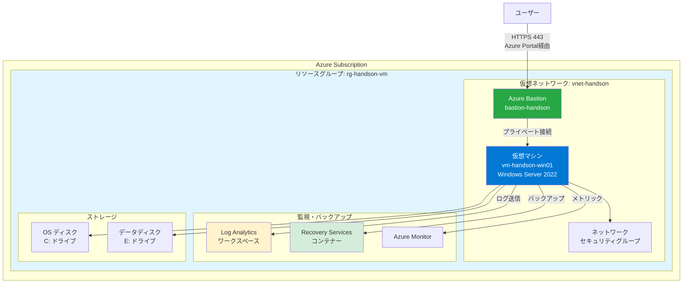
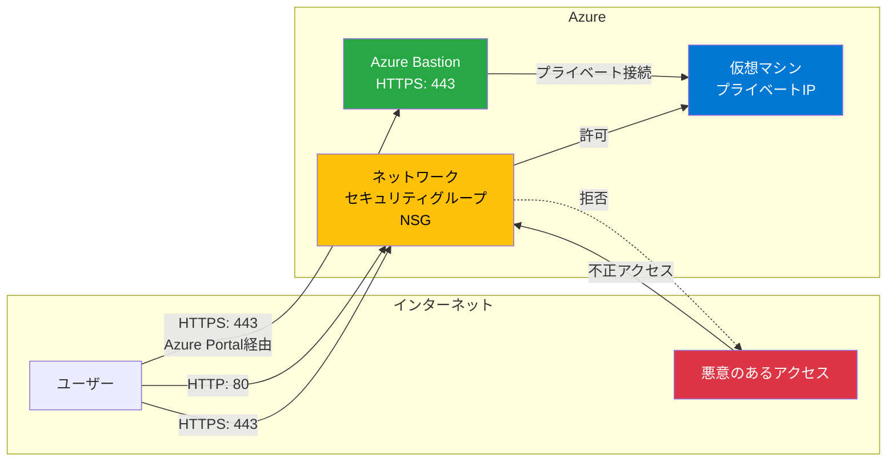
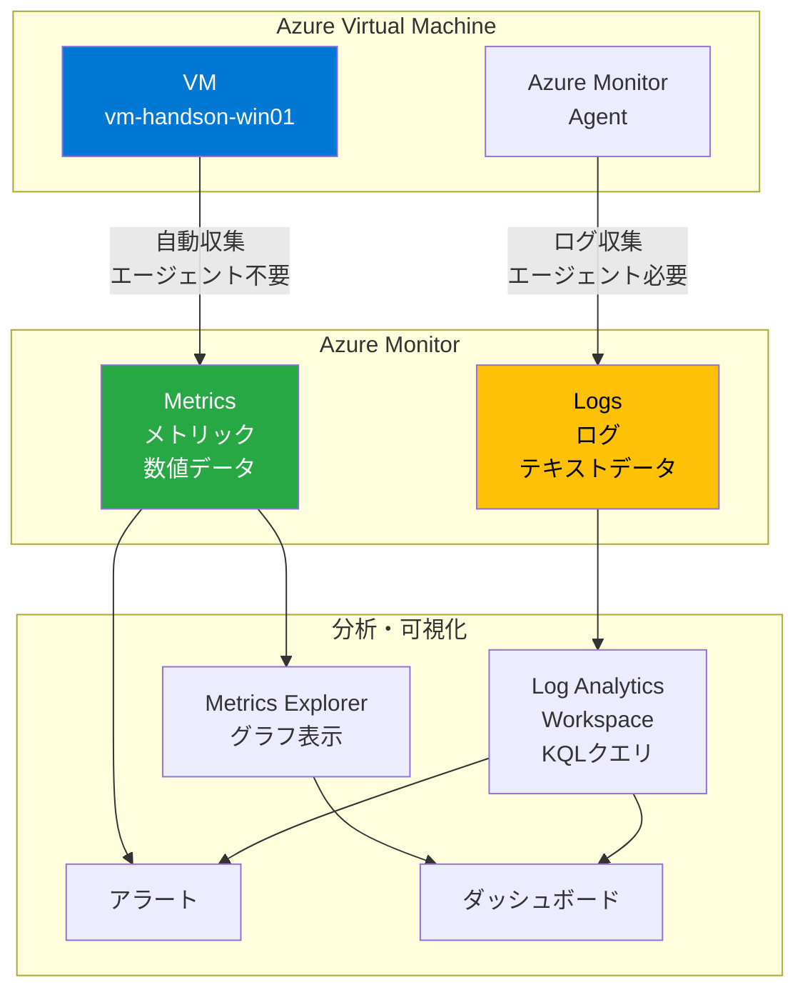
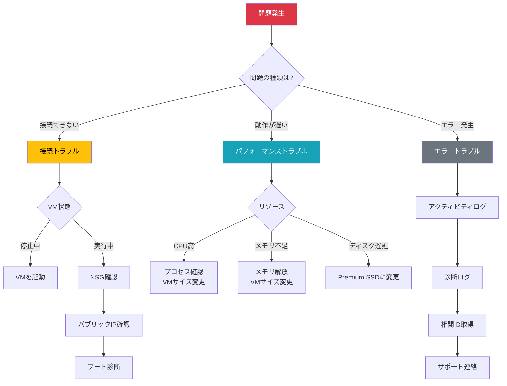

# Azure ハンズオン実習ガイド
## 仮想マシン管理の基礎

---

## 📑 目次

1. [前提条件](#前提条件)
2. [① サーバ構築（Windows Server VM作成）](#-サーバ構築windows-server-vm作成)
3. [② サーバの通信制御設定（ネットワークセキュリティグループ）](#-サーバの通信制御設定ネットワークセキュリティグループ)
4. [③ バックアップ＆リストア](#-バックアップリストア)
5. [④ リソース増強](#-リソース増強)
6. [⑤ サーバ負荷確認](#-サーバ負荷確認)
7. [⑥ トラブルシューティング](#-トラブルシューティング)
8. [ハンズオン完了後のクリーンアップ](#ハンズオン完了後のクリーンアップ)
9. [参考リソース](#参考リソース)
10. [まとめ](#まとめ)
11. [（参考）IaCを利用した場合](#参考iacを利用した場合)

---

## 前提条件

- Azureサブスクリプションが作成済み
- Azure Portalへのアクセス権限
- 所要時間: 約3-4時間

### ハンズオンの全体構成



> **Azure Bastion とは？**
> - パブリックIPアドレスを公開せずにVMに安全に接続できるサービス
> - RDPポート(3389)を外部に公開する必要がない
> - Azure Portal経由でHTTPS(443)のみで接続
> - DDoS攻撃やブルートフォース攻撃からVMを保護

---

## ① サーバ構築（Windows Server VM作成）

### 学習目標
- Azure Virtual Machineの基本概念を理解する
- Windows Server VMを作成・起動する

### 実習手順

#### 1-1. 仮想マシンの作成

1. **Azure Portalにサインイン**
   - https://portal.azure.com

2. **リソースグループの作成**
   - 「リソースグループ」を検索
   - 「+ 作成」をクリック
   - リソースグループ名: `rg-handson-vm`
   - リージョン: `Japan East`（東日本）
   - 「確認および作成」→「作成」

3. **仮想マシンの作成**
   - 「仮想マシン」を検索
   - 「+ 作成」→「Azure仮想マシン」を選択

4. **基本設定**
   - **プロジェクトの詳細**
     - サブスクリプション: 自分のサブスクリプション
     - リソースグループ: `rg-handson-vm`
   
   - **インスタンスの詳細**
     - 仮想マシン名: `vm-handson-win01`
     - 地域: `Japan East`
     - 可用性オプション: `インフラストラクチャ冗長は必要ありません`
     - セキュリティの種類: `Standard`
     - イメージ: `Windows Server 2022 Datacenter - x64 Gen2`
     - サイズ: `Standard_B2s (2vcpu、4GiBメモリ)`
   
   - **管理者アカウント**
     - ユーザー名: `azureuser`
     - パスワード: 複雑なパスワードを設定（記録しておく）
   
   - **受信ポートの規則**
     - パブリック受信ポート: `なし` (Bastion経由で接続)

5. **ディスク設定**
   - 「次: ディスク」をクリック
   - OSディスクの種類: `Standard SSD (ローカル冗長ストレージ)`
   - デフォルト設定のまま

6. **ネットワーク設定**
   - 「次: ネットワーク」をクリック
   - 仮想ネットワーク: 新規作成（デフォルト）
   - サブネット: デフォルト
   - **パブリックIP: `なし`** (Bastion経由でアクセス)
   - デフォルト設定のまま

7. **確認と作成**
   - 「確認および作成」をクリック
   - 検証に成功したら「作成」をクリック
   - デプロイ完了まで数分待機

#### 1-2. Azure Bastionのセットアップ

1. **Bastionの作成**
   - VMの「概要」ページで「接続」→「Bastion」を選択
   - 「Azure Bastionを使用する」をクリック
   
2. **Bastion の設定**
   - 名前: `bastion-handson`
   - 階層: `Basic` (標準機能) または `Standard` (高度な機能)
   - 仮想ネットワーク: `vnet-handson` (既存のVNet)
   - 新しいサブネット名: `AzureBastionSubnet` (自動作成)
     - アドレス範囲: `10.0.1.0/26` (最小 /26 が必要)
   - パブリックIPアドレス: 新規作成
     - 名前: `pip-bastion-handson`
   
3. **作成の実行**
   - 「作成」をクリック
   - デプロイ完了まで約10分待機

> **Azure Bastion のメリット**:
> - VMにパブリックIPが不要でセキュリティ向上
> - RDPポート(3389)を外部に公開不要
> - Azure Portal経由でHTTPS(443)のみで接続
> - DDoS/ブルートフォース攻撃からVMを保護

#### 1-3. 仮想マシンへの接続

1. **Bastion経由でVMに接続**
   - VMの「接続」→「Bastion」タブを選択
   - 認証の種類: `パスワード`
   - ユーザー名: `azureuser`
   - パスワード: 作成時に設定したパスワード
   - 「接続」をクリック

2. **接続の確認**
   - ブラウザ内で新しいタブが開き、VMのデスクトップが表示されます
   - サーバーマネージャーが自動的に起動します

> **ヒント**: Bastion接続はブラウザベースなので、クライアントにRDPクライアントは不要です

### 確認ポイント
- [ ] VMが正常に作成されたか
- [ ] Azure Bastionが正常にデプロイされたか
- [ ] Bastion経由でVMに接続できたか
- [ ] VMのステータスが「実行中」になっているか
- [ ] RDPでログインできるか

---

## ② サーバの通信制御設定（ネットワークセキュリティグループ）

### 学習目標
- ネットワークセキュリティグループ（NSG）の役割を理解する
- 受信・送信ルールを設定する

### NSGの仕組み



> **Bastionを使用する場合のNSGの役割**:
> - 管理アクセス(RDP/SSH)はBastion経由で行うため、NSGでRDP/SSHポートを開放する必要なし
> - NSGは主にアプリケーション層のポート(HTTP/HTTPS等)の制御に使用

### 実習手順

#### 2-1. 現在のNSG設定の確認

1. **VMの概要ページから「ネットワーク」を選択**
   - 左側メニューの「ネットワーク設定」をクリック

2. **既存のルールを確認**
   - 受信ポート規則を確認
   - Bastion使用時はRDP/SSHポートが開放されていないことを確認

#### 2-2. HTTPアクセスを許可するルールの追加

1. **受信セキュリティ規則の追加**
   - 「受信ポート規則の追加」をクリック
   
   - **設定内容**
     - ソース: `Any`
     - ソースポート範囲: `*`
     - 宛先: `Any`
     - サービス: `HTTP`
     - 宛先ポート範囲: `80`(自動入力)
     - プロトコル: `TCP`
     - アクション: `許可`
     - 優先度: `310`
     - 名前: `Allow-HTTP`
   
   - 「追加」をクリック

#### 2-3. HTTPS用のルールの追加

1. **再度「受信ポート規則の追加」**
   - サービス: `HTTPS`
   - 宛先ポート範囲: `443`
   - 優先度: `320`
   - 名前: `Allow-HTTPS`
   - 「追加」をクリック

#### 2-4. 送信ルールの確認

1. **送信セキュリティ規則タブを選択**
   - デフォルトで全ての送信トラフィックが許可されていることを確認

> **注意**: Bastion経由のRDP接続は自動的にAzureのサービスタグで許可されるため、手動でNSGルールを追加する必要はありません。

### 確認ポイント
- [ ] HTTP (80) ポートが許可されているか
- [ ] HTTPS (443) ポートが許可されているか
- [ ] RDP/SSHポートが外部に公開されていないことを確認できたか
- [ ] 優先度の概念を理解できたか

---

## ③ バックアップ＆リストア

### 学習目標
- Azure Backupの設定方法を理解する
- バックアップからの復元方法を学ぶ

### 実習手順

#### 3-1. Recovery Services コンテナーの作成

1. **Recovery Services コンテナーを検索**
   - Azure Portalで「Recovery Services コンテナー」を検索
   - 「+ 作成」をクリック

2. **コンテナーの設定**
   - リソースグループ: `rg-handson-vm`
   - コンテナー名: `rsv-handson-backup`
   - 地域: `Japan East`
   - 「確認および作成」→「作成」

#### 3-2. VMのバックアップを有効化

1. **VMの概要ページに戻る**
   - `vm-handson-win01` を開く

2. **バックアップの設定**
   - 左側メニューの「バックアップ」を選択
   - 「バックアップの有効化」をクリック

3. **バックアップポリシーの設定**
   - Recovery Servicesコンテナー: `rsv-handson-backup`
   - バックアップポリシー: 「新しいポリシーの作成」
     - ポリシー名: `policy-daily-backup`
     - バックアップスケジュール: 毎日、午前2:00
     - インスタント復旧スナップショットの保持: 2日間
     - 毎日のバックアップポイントの保持: 7日間
   - 「有効化」をクリック

#### 3-3. オンデマンドバックアップの実行

1. **即時バックアップの実行**
   - バックアップが有効化されたら「今すぐバックアップ」をクリック
   - 復旧ポイントの保持期限: 30日
   - 「OK」をクリック
   - バックアップジョブが開始（完了まで10-20分程度）

2. **バックアップジョブの監視**
   - Recovery Services コンテナー (`rsv-handson-backup`) を開く
   - 「バックアップジョブ」でステータスを確認

#### 3-4. ファイルレベルの復元（テスト）

1. **VMにRDP接続してテストファイルを作成**
   - Cドライブに `test-backup.txt` を作成
   - 内容: "This is a backup test file"

2. **ファイルを削除**
   - 作成したファイルを削除してごみ箱を空にする

3. **ファイルの復元**
   - Azure Portalで VM → 「バックアップ」を選択
   - 「ファイルの回復」をクリック
   - 復旧ポイントを選択
   - 「スクリプトのダウンロード」をクリック
   - VM内でスクリプトを実行
   - マウントされたドライブからファイルを復元

#### 3-5. VM全体の復元（オプション：デモのみ）

> **注意**: 実際に復元すると新しいVMが作成され課金されるため、手順のみ確認

1. **復元オプションの確認**
   - Recovery Services コンテナー → 「バックアップ項目」
   - 「Azure Virtual Machine」をクリック
   - 該当のVMを選択
   - 「VM の復元」をクリック
   
2. **復元オプション**
   - **新規作成**: 新しいVMを作成
   - **既存を置換**: 既存のVMのディスクを置換
   - **ディスクの復元**: ディスクのみ復元

### 確認ポイント
- [ ] Recovery Services コンテナーが作成されたか
- [ ] バックアップが正常に完了したか
- [ ] ファイルレベルの復元ができたか
- [ ] VM復元のオプションを理解できたか

---

## ④ リソース増強

### 学習目標
- VMのサイズ変更方法を理解する
- ディスクのサイズ変更とパフォーマンス向上方法を学ぶ
- スケールアウトの概念を理解する

### 実習手順

#### 4-1. CPU・メモリの増強（垂直スケーリング）

1. **VMを停止**
   - VM概要ページで「停止」をクリック
   - 「はい」をクリックして確認
   - ステータスが「停止済み(割り当て解除済み)」になるまで待機

2. **VMサイズの変更**
   - 左側メニューの「サイズ」を選択
   - 現在のサイズ: `Standard_B2s (2vcpu、4GiB)`
   - 新しいサイズを選択: `Standard_B2ms (2vcpu、8GiB)`
   - 「サイズ変更」をクリック

3. **VMを起動**
   - 「開始」をクリック
   - 起動完了を待つ

4. **リソース変更の確認**
   - RDPで接続
   - タスクマネージャーで実装メモリを確認
   - 8GB に増えていることを確認

#### 4-2. ストレージの増強

##### データディスクの追加

1. **新しいディスクの追加**
   - VM → 「ディスク」を選択
   - 「+ データディスクの作成と接続」をクリック
   
   - **設定内容**
     - ディスク名: `vm-handson-win01-datadisk01`
     - ソースの種類: `なし(空のディスク)`
     - サイズ: `64 GiB (Premium SSD)`
     - 暗号化: デフォルト
   
   - 「保存」をクリック

2. **VM内でディスクを初期化**
   - RDPでVMに接続
   - サーバーマネージャーを開く
   - 「ファイルサービスと記憶域サービス」→「ディスク」
   - 新しいディスクを右クリック → 「新しいボリューム」
   - ウィザードに従ってフォーマット（ドライブ文字: E）

##### ディスクパフォーマンスの向上

1. **ディスクタイプの変更**
   - VM → 「ディスク」を選択
   - OSディスクをクリック
   - 「サイズ + パフォーマンス」を選択
   - `Premium SSD` に変更（より高速）
   - 「保存」をクリック

2. **ディスクサイズの拡張**
   - データディスクをクリック
   - 「サイズ + パフォーマンス」を選択
   - サイズを `128 GiB` に変更
   - 「サイズ変更」をクリック

3. **VM内でボリュームを拡張**
   - RDPでVMに接続
   - ディスクの管理を開く
   - Eドライブを右クリック → 「ボリュームの拡張」
   - ウィザードに従って拡張

#### 4-3. スケールアウト（VM数を増やす）

##### 可用性セットの作成（基礎理解）

1. **可用性セットの作成**
   - 「可用性セット」を検索
   - 「+ 作成」をクリック
   - リソースグループ: `rg-handson-vm`
   - 名前: `avset-handson`
   - 地域: `Japan East`
   - 障害ドメイン: `2`
   - 更新ドメイン: `5`
   - 「作成」をクリック

##### ロードバランサーの作成（概念理解）

> **注意**: 実際に2台目のVMを作成すると課金されるため、概念のみ学習

1. **ロードバランサーの理解**
   - 複数のVMに負荷を分散
   - 高可用性の実現
   - ヘルスチェック機能

2. **スケールアウトの流れ**
   - 2台目のVMを作成（同じ可用性セット内）
   - ロードバランサーを作成
   - バックエンドプールに両方のVMを追加
   - 負荷分散ルールを設定

### 確認ポイント
- [ ] VMサイズが変更されメモリが増えたか
- [ ] データディスクが追加されたか
- [ ] ディスクサイズが拡張されたか
- [ ] スケールアウトの概念を理解できたか

---

## ⑤ サーバ負荷確認

### 学習目標
- Azure Monitorを使った監視方法を理解する
- メトリックとログの違いを学ぶ
- アラートの設定方法を理解する

### Azure Monitorの全体構成



### 実習手順

#### 5-1. Azure Monitorでメトリックを確認

1. **メトリックの表示**
   - VM概要ページで「メトリック」を選択
   - 「メトリック」ドロップダウンから選択
     - `Percentage CPU`（CPU使用率）
     - `Available Memory Bytes`（利用可能メモリ）
     - `Disk Read Bytes`（ディスク読み取り）
     - `Disk Write Bytes`（ディスク書き込み）
     - `Network In Total`（受信ネットワーク）
     - `Network Out Total`（送信ネットワーク）

2. **時間範囲の変更**
   - 「過去1時間」「過去24時間」「過去7日間」で表示

3. **複数メトリックの同時表示**
   - 「+ メトリックの追加」をクリック
   - CPU使用率とメモリを同時に表示

#### 5-2. VM Insights（拡張監視）の有効化

1. **Insightsの有効化**
   - VM → 「分析情報」を選択
   - 「有効にする」をクリック
   - Azure Monitor エージェントをインストール
   - 有効化まで数分待機

2. **パフォーマンスダッシュボードの確認**
   - CPU使用率の詳細グラフ
   - メモリ使用率
   - ディスクIOPS
   - ネットワークトラフィック

3. **マップ機能の確認**
   - 「マップ」タブを選択
   - VMの依存関係を視覚化
   - 接続されているリソースを確認

#### 5-3. ログクエリの実行

> **補足: Azure Monitor Workspace と Log Analytics ワークスペースの違い**
>
> | 項目 | Log Analytics ワークスペース | Azure Monitor Workspace |
> |------|----------------------------|-------------------------|
> | **正式名称** | Azure Monitor Logs | Azure Monitor managed service for Prometheus |
> | **用途** | ログデータの収集・分析 | Prometheusメトリックの収集・分析 |
> | **データ形式** | ログ(テキストベース) | メトリック(時系列データ) |
> | **クエリ言語** | KQL (Kusto Query Language) | PromQL (Prometheus Query Language) |
> | **主な対象** | VM、アプリケーションログ、イベントログ | Kubernetes(AKS)、コンテナメトリック |
> | **テーブル例** | Perf, Event, Syslog, Heartbeat | PrometheusMetrics |
> | **ツール連携** | Azure Monitor、Log Analytics | Grafana、Prometheus |
> | **このハンズオンでの使用** | ✅ 使用 (VMログ分析) | ❌ 使用しない |
>
> **簡単に言うと:**
> - **Log Analytics ワークスペース**: VMやアプリの「ログ」を保存・分析（このハンズオンで使用）
> - **Azure Monitor Workspace**: Kubernetes等の「メトリック」をPrometheus形式で保存・分析
>
> 本ハンズオンでは、VMのログとパフォーマンスカウンターを扱うため、**Log Analytics ワークスペース**を使用します。

1. **Log Analyticsワークスペースの作成**
   - 「Log Analyticsワークスペース」を検索
   - 「+ 作成」をクリック
   - リソースグループ: `rg-handson-vm`
   - 名前: `law-handson-logs`
   - 地域: `Japan East`
   - 「確認および作成」→「作成」

2. **VMからログ収集の設定**
   - VM → 「ログ」を選択
   - Log Analyticsワークスペースに接続
   - データの収集が開始されるまで10-15分程度かかる

3. **テーブルとデータの存在確認**

> **重要**: ログが収集されるまで時間がかかるため、まずデータが存在するか確認します

   ```kql
   // 利用可能なすべてのテーブルを表示
   search *
   | distinct $table
   | sort by $table asc
   ```

   ```kql
   // Perfテーブルが存在するか、データがあるか確認
   Perf
   | take 10
   ```

   ```kql
   // Eventテーブルが存在するか、データがあるか確認
   Event
   | take 10
   ```

   ```kql
   // 過去24時間にデータが収集されているか確認
   Perf
   | where TimeGenerated > ago(24h)
   | summarize Count = count() by bin(TimeGenerated, 1h)
   | render timechart
   ```

   ```kql
   // どのようなパフォーマンスカウンターが収集されているか確認
   Perf
   | distinct ObjectName, CounterName
   | sort by ObjectName, CounterName
   ```

**データが見つからない場合のトラブルシューティング**

1. **Azure Monitor エージェントの確認**
   - VM → 「拡張機能とアプリケーション」
   - `AzureMonitorWindowsAgent` または `MicrosoftMonitoringAgent` がインストールされているか確認
   - 状態が「プロビジョニングに成功しました」になっているか確認

2. **データ収集ルールの設定**

> **重要**: HeartbeatとInsightsMetricsのみ表示される場合、PerfとEventテーブルを使用するにはデータ収集ルールの追加設定が必要です

   **方法1: データ収集ルール(DCR)を新規作成**
   
   - Azure Portalで「監視」→「データ収集ルール」を検索
   - 「+ 作成」をクリック
   
   - **基本タブ**
     - リソースグループ: `rg-handson-vm`
     - ルール名: `dcr-handson-perf-event`
     - リージョン: `Japan East`
     - プラットフォームの種類: `Windows`
   
   - **リソースタブ**
     - 「+ リソースの追加」をクリック
     - 対象VM (`vm-handson-win01`) を選択
     - 「適用」をクリック
   
   - **収集と配信タブ**
     
     **パフォーマンスカウンターの追加:**
     - 「+ データソースの追加」をクリック
     - データソースの種類: `パフォーマンスカウンター`
     - 「基本」を選択（すべての一般的なカウンターを収集）
     - サンプルレート: `60秒`
     - 「次: 宛先」をクリック
     - アカウントまたは名前空間: Log Analyticsワークスペース (`law-handson-logs`) を選択
     - 「データソースの追加」をクリック
     
     **Windowsイベントログの追加:**
     - 再度「+ データソースの追加」をクリック
     - データソースの種類: `Windowsイベントログ`
     - **収集するログを選択:**
       - ☑ Application
         - ☑ Critical
         - ☑ Error
         - ☑ Warning
         - ☑ Information
       - ☑ System
         - ☑ Critical
         - ☑ Error
         - ☑ Warning
         - ☑ Information
       - ☑ Security (オプション)
         - ☑ Audit success
         - ☑ Audit failure
     - 「次: 宛先」をクリック
     - アカウントまたは名前空間: Log Analyticsワークスペース (`law-handson-logs`) を選択
     - 「データソースの追加」をクリック
   
   - **確認および作成**
     - 設定を確認
     - 「作成」をクリック

   **方法2: VMから直接設定（レガシー方式 - 簡単）**
   
   > 注: この方法はレガシーMMA(Microsoft Monitoring Agent)を使用します
   
   - VM → 「ログ」を選択
   - 「有効にする」をクリック（まだ有効化していない場合）
   - Log Analyticsワークスペース (`law-handson-logs`) を選択
   - エージェントがインストールされるまで待機
   
   その後、Log Analyticsワークスペースでデータソースを設定:
   - Log Analyticsワークスペース (`law-handson-logs`) を開く
   - 「エージェント」→「エージェント構成」を選択（または「設定」→「エージェント構成」）
   
   **Windowsパフォーマンスカウンターの追加:**
   - 「Windowsパフォーマンスカウンター」タブを選択
   - 「+ パフォーマンスカウンターの追加」をクリック
   - 推奨カウンターを追加:
     - `Processor(_Total)\% Processor Time` - 60秒
     - `Memory\Available MBytes` - 60秒
     - `LogicalDisk(_Total)\% Free Space` - 60秒
     - `LogicalDisk(_Total)\Disk Reads/sec` - 60秒
     - `LogicalDisk(_Total)\Disk Writes/sec` - 60秒
     - `Network Adapter(*)\Bytes Received/sec` - 60秒
     - `Network Adapter(*)\Bytes Sent/sec` - 60秒
     - `System\Processor Queue Length` - 60秒
   - 「適用」をクリック
   
   **Windowsイベントログの追加:**
   - 「Windowsイベントログ」タブを選択
   - 以下を追加:
     - ログ名: `Application` - レベル: Error, Warning, Information
     - ログ名: `System` - レベル: Error, Warning, Information
   - 「適用」をクリック

3. **データ収集の待機**
   - エージェントのインストールとデータ収集ルールの適用後、初回データが表示されるまで**15-30分**かかる場合があります
   - 以下のクエリで最新データを確認:

   ```kql
   // 最新のデータ収集時刻を確認
   Perf
   | summarize max(TimeGenerated) by Computer
   ```

   ```kql
   // Heartbeatでエージェントが稼働しているか確認
   Heartbeat
   | where Computer contains "vm-handson"
   | summarize max(TimeGenerated) by Computer
   | project Computer, LastHeartbeat = max_TimeGenerated
   ```

4. **Kustoクエリの実行（データ確認後）**

   ```kql
   // CPU使用率が80%を超えた時間を表示
   Perf
   | where ObjectName == "Processor" and CounterName == "% Processor Time"
   | where CounterValue > 80
   | project TimeGenerated, Computer, CounterValue
   | order by TimeGenerated desc
   ```

   ```kql
   // 利用可能メモリの推移
   Perf
   | where ObjectName == "Memory" and CounterName == "Available Bytes"
   | summarize AvgMemory = avg(CounterValue) by bin(TimeGenerated, 5m)
   | render timechart
   ```

   ```kql
   // 利用可能メモリの推移（VMごとに集計）
   Perf
   | where ObjectName == "Memory" and CounterName == "Available Bytes"
   | summarize AvgMemory = avg(CounterValue) by bin(TimeGenerated, 5m), Computer
   | render timechart
   ```

   ```kql
   // 利用可能メモリをMB単位で表示（わかりやすく）
   Perf
   | where ObjectName == "Memory" and CounterName == "Available Bytes"
   | extend AvailableMB = CounterValue / 1024 / 1024
   | summarize AvgMemoryMB = avg(AvailableMB) by bin(TimeGenerated, 5m), Computer
   | render timechart
   ```

   ```kql
   // ディスクI/Oの確認
   Perf
   | where ObjectName == "LogicalDisk"
   | where CounterName in ("Disk Reads/sec", "Disk Writes/sec")
   | project TimeGenerated, CounterName, CounterValue, InstanceName
   | order by TimeGenerated desc
   ```

   ```kql
   // ディスクI/OをVMごとに集計
   Perf
   | where ObjectName == "LogicalDisk"
   | where CounterName in ("Disk Reads/sec", "Disk Writes/sec")
   | summarize AvgValue = avg(CounterValue) by bin(TimeGenerated, 5m), Computer, CounterName
   | render timechart
   ```

**ディスクの容量と使用状況の確認**

<details>
<summary><b>📊 ステップ0-6: データ収集状況の診断クエリ（クリックして展開）</b></summary>

> **重要**: まず、データが実際に収集されているか段階的に確認します

   ```kql
   // ステップ0: Perfテーブルにデータがあるか最初に確認
   Perf
   | take 10
   ```

   ```kql
   // ステップ1: どのObjectNameが収集されているか確認
   Perf
   | distinct ObjectName
   | sort by ObjectName asc
   ```

   ```kql
   // ステップ2: LogicalDiskのカウンターが収集されているか確認
   Perf
   | where ObjectName == "LogicalDisk"
   | distinct CounterName
   | sort by CounterName asc
   ```

   ```kql
   // ステップ3: LogicalDiskの生データを確認（カウンター指定なし）
   Perf
   | where ObjectName == "LogicalDisk"
   | take 10
   ```

   ```kql
   // ステップ4: % Free Spaceのデータが存在するか確認
   Perf
   | where ObjectName == "LogicalDisk"
   | where CounterName == "% Free Space"
   | take 10
   ```

   ```kql
   // ステップ5: 過去何日分のデータがあるか確認
   Perf
   | where ObjectName == "LogicalDisk"
   | summarize 
       OldestData = min(TimeGenerated),
       LatestData = max(TimeGenerated),
       Count = count()
   ```

   ```kql
   // ステップ6: InstanceNameを確認
   Perf
   | where ObjectName == "LogicalDisk"
   | distinct InstanceName
   | sort by InstanceName
   ```

</details>

**❌ ステップ2で「LogicalDisk」が表示されない場合**

LogicalDiskのパフォーマンスカウンターが収集されていません。以下を確認してください:

1. **データ収集ルールの確認**
   - Azure Portal → 「データ収集ルール」
   - `dcr-handson-perf-event` を開く
   - 「データソース」→ パフォーマンスカウンター
   - **「基本」を選択している場合、LogicalDiskが含まれない可能性があります**
   
2. **カスタムカウンターの追加が必要**
   - データソースを編集
   - 「カスタム」を選択
   - 以下を手動で追加:
     ```
     \LogicalDisk(*)\% Free Space
     \LogicalDisk(*)\Free Megabytes
     \LogicalDisk(*)\Disk Reads/sec
     \LogicalDisk(*)\Disk Writes/sec
     ```
   - サンプルレート: 60秒
   - 宛先: Log Analytics ワークスペース
   - 「保存」

3. **または、Log Analytics ワークスペースのエージェント構成で追加（レガシー）**
   - Log Analytics ワークスペース → 「設定」→ 「エージェント」→ 「エージェント構成」
   - 「Windows パフォーマンスカウンター」タブ
   - 「+ パフォーマンスカウンターの追加」
   - 以下を追加:
     - `LogicalDisk(*)\% Free Space` - 60秒間隔
     - `LogicalDisk(*)\Free Megabytes` - 60秒間隔
   - 「適用」をクリック

4. **待機時間**
   - カウンター追加後、データが表示されるまで **15-30分** かかります
   - `Heartbeat` テーブルでエージェントが動作しているか確認:
   
   ```kql
   Heartbeat
   | where Computer contains "vm-handson"
   | summarize LastHeartbeat = max(TimeGenerated) by Computer
   ```

**✅ ステップ6でInstanceNameが表示された場合**

データ収集は正常です。次のセクションのクエリを使用してください。

**よくある問題: データ収集ルールで容量関連カウンターが収集されていない**

データ収集ルールで「基本」を選択した場合、ディスクの空き容量関連のカウンターが含まれていない可能性があります。以下の手順で追加してください:

1. **データ収集ルールにカウンターを追加**
   - Azure Portal → 「データ収集ルール」→ `dcr-handson-perf-event` を開く
   - 「データソース」を選択
   - パフォーマンスカウンターのデータソースを編集
   - 「カスタム」を選択
   - 以下のカウンターを追加:
     ```
     \LogicalDisk(*)\% Free Space
     \LogicalDisk(*)\Free Megabytes
     \LogicalDisk(*)\Disk Reads/sec
     \LogicalDisk(*)\Disk Writes/sec
     ```
   - サンプルレート: 60秒
   - 「保存」をクリック

2. **または、Log Analytics ワークスペースで直接追加（レガシー方式）**
   - Log Analytics ワークスペース → 「エージェント」→ 「エージェント構成」
   - 「Windows パフォーマンスカウンター」タブ
   - 以下を追加:
     - `LogicalDisk(*)\% Free Space` - 60秒
     - `LogicalDisk(*)\Free Megabytes` - 60秒

3. **データ収集を待つ**
   - カウンター追加後、データが表示されるまで **10-20分** 待機

**データ収集後に実行するクエリ:**

<details>
<summary><b>💾 ディスク使用状況の確認クエリ（クリックして展開）</b></summary>

> **トラブルシューティング**: InstanceName の値が期待と異なる場合があります
> 
> - Windows の場合: `C:`, `D:`, `E:` など
> - 一部の環境では: `C: D: E:` (スペース含む) や `HarddiskVolume1` など
> - `_Total` は合計値なので通常は除外します
>
> **まず InstanceName を確認してから、適切な条件でフィルタリングしてください**

   ```kql
   // 最もシンプルなクエリ: 全てのディスクデータを表示（フィルタなし）
   Perf
   | where ObjectName == "LogicalDisk"
   | where CounterName == "% Free Space"
   | where TimeGenerated > ago(1h)
   | project TimeGenerated, Computer, InstanceName, CounterValue
   | order by TimeGenerated desc
   | take 20
   ```

   ```kql
   // ディスクの空き容量率（InstanceNameフィルタを調整）
   Perf
   | where ObjectName == "LogicalDisk"
   | where CounterName == "% Free Space"
   | where TimeGenerated > ago(1h)
   // _Total以外のすべてのドライブを表示
   | where InstanceName != "_Total"
   | summarize 
       FreeSpacePercent = avg(CounterValue),
       LastCheck = max(TimeGenerated)
       by Computer, InstanceName
   | extend UsedSpacePercent = 100 - FreeSpacePercent
   | project Computer, Drive = InstanceName, FreeSpacePercent, UsedSpacePercent, LastCheck
   | order by Computer, Drive
   ```

   ```kql
   // ディスクの空き容量（Free Megabytesを使用）
   Perf
   | where ObjectName == "LogicalDisk"
   | where CounterName == "Free Megabytes"
   | where TimeGenerated > ago(1h)
   | where InstanceName != "_Total"
   | summarize 
       FreeMB = avg(CounterValue),
       LastCheck = max(TimeGenerated)
       by Computer, InstanceName
   | project Computer, Drive = InstanceName, FreeMB, FreeGB = round(FreeMB / 1024, 2), LastCheck
   | order by Computer, Drive
   ```

   ```kql
   // ディスクの総容量と使用状況（簡略版 - エラーが出にくい）
   Perf
   | where ObjectName == "LogicalDisk"
   | where TimeGenerated > ago(1h)
   | where InstanceName != "_Total"
   | where CounterName in ("Free Megabytes", "% Free Space")
   | summarize CounterValue = avg(CounterValue) by Computer, InstanceName, CounterName
   | evaluate pivot(CounterName, sum(CounterValue))
   | extend FreeMB = toreal(['Free Megabytes'])
   | extend FreePercent = toreal(['% Free Space'])
   | where isnotnull(FreeMB) and isnotnull(FreePercent)
   | extend TotalMB = FreeMB / (FreePercent / 100)
   | extend UsedMB = TotalMB - FreeMB
   | extend UsedPercent = 100 - FreePercent
   | project 
       Computer,
       Drive = InstanceName,
       TotalGB = round(TotalMB / 1024, 2),
       UsedGB = round(UsedMB / 1024, 2),
       FreeGB = round(FreeMB / 1024, 2),
       UsedPercent = round(UsedPercent, 2),
       FreePercent = round(FreePercent, 2)
   | order by Computer, Drive
   ```

   ```kql
   // 空き容量が少ないディスクを警告（% Free Spaceが必要）
   Perf
   | where ObjectName == "LogicalDisk"
   | where CounterName == "% Free Space"
   | where InstanceName != "_Total"
   | where TimeGenerated > ago(1h)
   | summarize 
       FreeSpacePercent = avg(CounterValue),
       LastCheck = max(TimeGenerated)
       by Computer, InstanceName
   | where FreeSpacePercent < 20
   | extend Status = case(
       FreeSpacePercent < 10, "🔴 Critical",
       FreeSpacePercent < 20, "⚠️ Warning",
       "✅ OK"
   )
   | project Computer, Drive = InstanceName, FreeSpacePercent, Status, LastCheck
   | order by FreeSpacePercent asc
   ```

</details>

**代替方法: VM内でPowerShellスクリプトを実行してログ出力**

Perfカウンターが収集されない場合、VM内でディスク情報を取得してカスタムログとして送信する方法もあります。

   ```powershell
   # VM内で実行（RDP接続後）
   Get-PSDrive -PSProvider FileSystem | 
   Select-Object Name, 
       @{N="UsedGB";E={[math]::Round($_.Used/1GB,2)}},
       @{N="FreeGB";E={[math]::Round($_.Free/1GB,2)}},
       @{N="TotalGB";E={[math]::Round(($_.Used+$_.Free)/1GB,2)}},
       @{N="PercentFree";E={[math]::Round($_.Free/($_.Used+$_.Free)*100,2)}}
   ```

> **注意**: Perfテーブルではディスクの種類（Standard SSD、Premium SSD等）は確認できません。
> ディスクの種類を確認するには、Azure Portalの VM → 「ディスク」画面を使用してください。

#### 5-4. アラートの設定

1. **CPU使用率のアラート作成**
   - VM → 「アラート」を選択
   - 「+ 作成」→「アラートルール」
   
   - **条件の設定**
     - シグナル: `Percentage CPU`
     - しきい値: `静的`
     - 集計の種類: `平均`
     - 演算子: `次の値より大きい`
     - しきい値: `80`
     - 評価の頻度: `5分`
   
   - **アクショングループの作成**
     - 「+ アクショングループの作成」
     - 名前: `ag-handson-alert`
     - アクションタイプ: `メール/SMS メッセージ/プッシュ/音声`
     - 電子メール: 自分のメールアドレス
   
   - **アラートルールの詳細**
     - アラートルール名: `alert-high-cpu`
     - 重大度: `警告(Sev 2)`
   
   - 「確認および作成」→「作成」

2. **メモリ不足のアラート作成**
   - シグナル: `Available Memory Bytes`
   - しきい値: `500000000` (500MB)
   - 演算子: `次の値より小さい`

### 確認ポイント
- [ ] メトリックが表示されるか
- [ ] VM Insightsが有効化されたか
- [ ] Kustoクエリを実行できたか
- [ ] アラートが作成されたか

---

## ⑥ トラブルシューティング

### 学習目標
- 一般的なトラブルの診断方法を学ぶ
- Azure診断ツールの使い方を理解する
- ログの見方を習得する

### トラブルシューティングのフロー



### 実習手順

#### 6-1. 通信不可のトラブルシューティング

##### シナリオ1: RDP接続できない

1. **VMの状態確認**
   - VM概要ページで「実行中」になっているか確認
   - 停止している場合は「開始」をクリック

2. **ネットワーク接続の診断**
   - VM → 「接続のトラブルシューティング」を選択
   - 宛先: VM のプライベートIP
   - プロトコル: `TCP`
   - ポート: `3389`
   - 「確認」をクリック
   - 結果を確認

3. **NSGルールの確認**
   - VM → 「ネットワーク設定」
   - RDP (3389) が許可されているか確認
   - ソースIPが自分のIPを含んでいるか確認

4. **パブリックIPの確認**
   - VM概要ページでパブリックIPが割り当てられているか
   - 割り当てられていない場合は新規作成

5. **ブート診断の確認**
   - VM → 「ブート診断」
   - スクリーンショットでOSが起動しているか確認
   - シリアルログでエラーがないか確認

##### シナリオ2: Webサーバへのアクセスができない

1. **IISのインストール（VM内）**
   - RDPでVMに接続
   - サーバーマネージャーを開く
   - 「役割と機能の追加」→「Webサーバー(IIS)」をインストール

2. **ローカルでの確認**
   - VM内でブラウザを開く
   - `http://localhost` にアクセス
   - IISのデフォルトページが表示されることを確認

3. **外部からアクセス不可の場合**
   - NSGでポート80が許可されているか確認
   - Windowsファイアウォールの確認
     - コントロールパネル → Windows Defender ファイアウォール
     - 「詳細設定」→「受信の規則」
     - 「World Wide Web サービス (HTTP トラフィック受信)」が有効か確認

4. **Network Watcherの接続トラブルシューティング**
   - 「Network Watcher」を検索
   - 「接続のトラブルシューティング」を選択
   - ソース: 別のVM（存在する場合）または自分のPC
   - 宛先: 対象VM
   - ポート: `80`
   - 診断結果を確認

#### 6-2. 動作遅延のトラブルシューティング

##### CPU使用率が高い場合

1. **Azure MonitorでCPU使用率を確認**
   - VM → 「メトリック」
   - `Percentage CPU` を確認
   - 持続的に高い場合はVMサイズの変更を検討

2. **VM内でプロセスを確認**
   - RDPで接続
   - タスクマネージャーを開く
   - 「詳細」タブでCPU使用率の高いプロセスを特定

3. **パフォーマンスモニターで詳細分析**
   - `perfmon` を実行
   - カウンターを追加
     - `Processor(_Total)\% Processor Time`
     - `System\Processor Queue Length`
   - リアルタイムで監視

##### メモリ不足の場合

1. **メモリメトリックの確認**
   - VM → 「メトリック」
   - `Available Memory Bytes` を確認

2. **VM内でメモリ使用状況を確認**
   - タスクマネージャー → 「パフォーマンス」タブ
   - メモリが不足している場合はVMサイズの変更

3. **ページファイルの設定確認**
   - システムのプロパティ → 詳細設定
   - パフォーマンス → 設定 → 詳細設定
   - 仮想メモリの設定を確認

##### ディスクI/Oが遅い場合

1. **ディスクメトリックの確認**
   - VM → 「メトリック」
   - `Disk Read Operations/Sec`
   - `Disk Write Operations/Sec`
   - `OS Disk Queue Depth`

2. **ディスクの種類を確認**
   - Standard HDD → Standard SSD → Premium SSD の順に高速
   - 必要に応じてディスクをアップグレード

3. **リソースモニターで確認**
   - `resmon` を実行
   - 「ディスク」タブでI/Oの詳細を確認

#### 6-3. クラウド側エラーログの確認

##### アクティビティログの確認

1. **アクティビティログを開く**
   - VM → 「アクティビティログ」
   - 過去のすべての操作が記録されている

2. **重要なイベントを確認**
   - VMの開始/停止
   - サイズ変更
   - 拡張機能のインストール
   - エラーや警告をフィルタリング

3. **特定のエラーの詳細**
   - エラーをクリック
   - JSONビューで詳細情報を確認
   - 相関IDをコピー（サポート問い合わせ時に使用）

##### 診断設定とログ

1. **診断設定の有効化**
   - VM → 「診断設定」
   - 「ゲストレベルの監視を有効にする」
   - ストレージアカウントを指定

2. **イベントログの収集**
   - Windows イベントログを有効化
     - システム
     - アプリケーション
     - セキュリティ
   - Log Analyticsに送信

3. **ログクエリでエラーを検索**

   ```kql
   // Windowsイベントログのエラー
   Event
   | where EventLevelName == "Error"
   | project TimeGenerated, Computer, EventID, RenderedDescription
   | order by TimeGenerated desc
   | take 50
   ```

   ```kql
   // システムエラーのみ抽出
   Event
   | where EventLog == "System" and EventLevelName == "Error"
   | summarize Count = count() by EventID, RenderedDescription
   | order by Count desc
   ```

##### サービスヘルスの確認

1. **Service Healthを開く**
   - 「Service Health」を検索
   - 現在のAzureサービス状態を確認

2. **リソースヘルスの確認**
   - VM → 「リソース正常性」
   - プラットフォーム側の問題がないか確認
   - 過去の正常性履歴を確認

##### パフォーマンス診断の実行

1. **パフォーマンス診断の実行**
   - VM → 「パフォーマンス診断」
   - 「診断の実行」をクリック
   - シナリオを選択
     - `パフォーマンス分析`
     - `VM が遅い`
   - 診断の実行（5-10分）

2. **診断レポートの確認**
   - CPU、メモリ、ディスク、ネットワークの分析結果
   - 推奨事項を確認
   - レポートをダウンロード

### トラブルシューティングチートシート

| 問題 | 確認箇所 | 解決方法 |
|------|---------|---------|
| **RDP接続できない** | VMステータス、NSG、パブリックIP | VMを起動、NSGルール追加、IP確認 |
| **Webアクセスできない** | NSG、Windowsファイアウォール、IIS | ポート80許可、FW設定、IIS起動 |
| **CPU使用率が高い** | メトリック、タスクマネージャー | 不要なプロセス停止、VMサイズ変更 |
| **メモリ不足** | メモリメトリック | VMサイズ変更、メモリリーク調査 |
| **ディスクが遅い** | ディスクメトリック、ディスクタイプ | Premium SSDに変更、サイズ拡張 |
| **VMが起動しない** | ブート診断、シリアルログ | スクリーンショット確認、サポート連絡 |
| **不明なエラー** | アクティビティログ、診断ログ | エラーメッセージ確認、相関ID取得 |

### 確認ポイント
- [ ] RDP接続のトラブルシューティングができるか
- [ ] NSGルールを確認・修正できるか
- [ ] パフォーマンス問題を診断できるか
- [ ] ログから問題を特定できるか
- [ ] Azure診断ツールを使えるか

---

## ハンズオン完了後のクリーンアップ

### コスト削減のためのリソース削除

1. **バックアップの停止**
   - Recovery Services コンテナー → バックアップ項目
   - VMのバックアップを停止してデータを削除

2. **リソースグループの削除**
   - 「リソースグループ」を開く
   - `rg-handson-vm` を選択
   - 「リソースグループの削除」をクリック
   - リソースグループ名を入力して確認
   - 「削除」をクリック

> **注意**: これにより全てのリソース（VM、ディスク、ネットワーク、バックアップ等）が削除されます

---

## 参考リソース

### 公式ドキュメント
- [Azure Virtual Machines ドキュメント](https://learn.microsoft.com/azure/virtual-machines/)
- [ネットワークセキュリティグループ](https://learn.microsoft.com/azure/virtual-network/network-security-groups-overview)
- [Azure Backup ドキュメント](https://learn.microsoft.com/azure/backup/)
- [Azure Monitor ドキュメント](https://learn.microsoft.com/azure/azure-monitor/)
- [VM トラブルシューティング](https://learn.microsoft.com/azure/virtual-machines/troubleshooting/)

### 学習パス
- [Microsoft Learn: Azure の基礎](https://learn.microsoft.com/training/paths/azure-fundamentals/)
- [Microsoft Learn: Azure 仮想マシンの管理](https://learn.microsoft.com/training/paths/administer-infrastructure-resources-in-azure/)

---

## まとめ

このハンズオンを通じて、以下のスキルを習得しました:

✅ Azure VM（Windows Server）の作成と接続
✅ ネットワークセキュリティグループによる通信制御
✅ Azure Backupを使ったバックアップと復元
✅ CPU・メモリ・ストレージのリソース増強
✅ Azure Monitorを使った監視とアラート設定
✅ 一般的なトラブルの診断と解決方法

これらの基礎知識は、Azureでの実際の運用業務に直接活用できます。

---

## （参考）IaCを利用した場合

### 学習目標

- Infrastructure as Code (IaC) の概念を理解する
- Bicepを使用してAzureリソースを自動デプロイする
- 再現可能なインフラストラクチャ構築を学ぶ

### Bicepとは？

Bicep は、Azureリソースを宣言的に定義するための言語です。JSONベースのARM テンプレートよりも簡潔で読みやすく、IntelliSenseサポートもあります。

**メリット:**
- コードとしてインフラを管理（バージョン管理可能）
- 再現性の高いデプロイ
- 手動作業によるミスの削減
- 環境の標準化

### Bicepファイルの構成

このハンズオンで作成したリソースをBicepでデプロイするための完全なコードを提供します。

#### main.bicep

```bicep
// パラメータ定義
@description('リソースのデプロイ先リージョン')
param location string = 'japaneast'

@description('仮想マシンの管理者ユーザー名')
param adminUsername string = 'azureuser'

@description('仮想マシンの管理者パスワード')
@secure()
param adminPassword string

@description('仮想マシンのサイズ')
param vmSize string = 'Standard_B2s'

@description('環境タグ')
param environmentTag string = 'Hands-on'

// 変数定義
var resourceGroupName = 'rg-handson-vm'
var vnetName = 'vnet-handson'
var subnetName = 'default'
var bastionSubnetName = 'AzureBastionSubnet'
var vmName = 'vm-handson-win01'
var nicName = '${vmName}-nic'
var nsgName = '${vmName}-nsg'
var bastionName = 'bastion-handson'
var bastionPublicIpName = 'pip-${bastionName}'
var osDiskName = '${vmName}-osdisk'
var dataDiskName = '${vmName}-datadisk'
var lawName = 'law-handson-${uniqueString(resourceGroup().id)}'
var rsvName = 'rsv-handson'
var backupPolicyName = 'DefaultPolicy'

// 仮想ネットワーク
resource vnet 'Microsoft.Network/virtualNetworks@2023-05-01' = {
  name: vnetName
  location: location
  tags: {
    Environment: environmentTag
    Purpose: 'Training'
  }
  properties: {
    addressSpace: {
      addressPrefixes: [
        '10.0.0.0/16'
      ]
    }
    subnets: [
      {
        name: subnetName
        properties: {
          addressPrefix: '10.0.0.0/24'
          networkSecurityGroup: {
            id: nsg.id
          }
        }
      }
      {
        name: bastionSubnetName
        properties: {
          addressPrefix: '10.0.1.0/26'
        }
      }
    ]
  }
}

// ネットワークセキュリティグループ
resource nsg 'Microsoft.Network/networkSecurityGroups@2023-05-01' = {
  name: nsgName
  location: location
  tags: {
    Environment: environmentTag
    Purpose: 'Training'
  }
  properties: {
    securityRules: [
      {
        name: 'Allow-HTTP'
        properties: {
          priority: 310
          protocol: 'Tcp'
          access: 'Allow'
          direction: 'Inbound'
          sourceAddressPrefix: '*'
          sourcePortRange: '*'
          destinationAddressPrefix: '*'
          destinationPortRange: '80'
        }
      }
      {
        name: 'Allow-HTTPS'
        properties: {
          priority: 320
          protocol: 'Tcp'
          access: 'Allow'
          direction: 'Inbound'
          sourceAddressPrefix: '*'
          sourcePortRange: '*'
          destinationAddressPrefix: '*'
          destinationPortRange: '443'
        }
      }
    ]
  }
}

// ネットワークインターフェース
resource nic 'Microsoft.Network/networkInterfaces@2023-05-01' = {
  name: nicName
  location: location
  tags: {
    Environment: environmentTag
    Purpose: 'Training'
  }
  properties: {
    ipConfigurations: [
      {
        name: 'ipconfig1'
        properties: {
          subnet: {
            id: vnet.properties.subnets[0].id
          }
          privateIPAllocationMethod: 'Dynamic'
        }
      }
    ]
  }
}

// 仮想マシン
resource vm 'Microsoft.Compute/virtualMachines@2023-07-01' = {
  name: vmName
  location: location
  tags: {
    Environment: environmentTag
    Purpose: 'Training'
  }
  properties: {
    hardwareProfile: {
      vmSize: vmSize
    }
    osProfile: {
      computerName: vmName
      adminUsername: adminUsername
      adminPassword: adminPassword
      windowsConfiguration: {
        enableAutomaticUpdates: true
        provisionVMAgent: true
      }
    }
    storageProfile: {
      imageReference: {
        publisher: 'MicrosoftWindowsServer'
        offer: 'WindowsServer'
        sku: '2022-datacenter-azure-edition'
        version: 'latest'
      }
      osDisk: {
        name: osDiskName
        createOption: 'FromImage'
        managedDisk: {
          storageAccountType: 'StandardSSD_LRS'
        }
      }
      dataDisks: [
        {
          name: dataDiskName
          diskSizeGB: 128
          lun: 0
          createOption: 'Empty'
          managedDisk: {
            storageAccountType: 'StandardSSD_LRS'
          }
        }
      ]
    }
    networkProfile: {
      networkInterfaces: [
        {
          id: nic.id
        }
      ]
    }
  }
}

// Azure Bastion パブリックIP
resource bastionPublicIp 'Microsoft.Network/publicIPAddresses@2023-05-01' = {
  name: bastionPublicIpName
  location: location
  tags: {
    Environment: environmentTag
    Purpose: 'Training'
  }
  sku: {
    name: 'Standard'
  }
  properties: {
    publicIPAllocationMethod: 'Static'
  }
}

// Azure Bastion
resource bastion 'Microsoft.Network/bastionHosts@2023-05-01' = {
  name: bastionName
  location: location
  tags: {
    Environment: environmentTag
    Purpose: 'Training'
  }
  sku: {
    name: 'Basic'
  }
  properties: {
    ipConfigurations: [
      {
        name: 'bastionIpConfig'
        properties: {
          subnet: {
            id: vnet.properties.subnets[1].id
          }
          publicIPAddress: {
            id: bastionPublicIp.id
          }
        }
      }
    ]
  }
}

// Log Analytics ワークスペース
resource logAnalytics 'Microsoft.OperationalInsights/workspaces@2022-10-01' = {
  name: lawName
  location: location
  tags: {
    Environment: environmentTag
    Purpose: 'Training'
  }
  properties: {
    sku: {
      name: 'PerGB2018'
    }
    retentionInDays: 30
  }
}

// Azure Monitor Agent 拡張機能
resource vmExtension 'Microsoft.Compute/virtualMachines/extensions@2023-07-01' = {
  parent: vm
  name: 'AzureMonitorWindowsAgent'
  location: location
  properties: {
    publisher: 'Microsoft.Azure.Monitor'
    type: 'AzureMonitorWindowsAgent'
    typeHandlerVersion: '1.0'
    autoUpgradeMinorVersion: true
  }
}

// データ収集ルール
resource dcr 'Microsoft.Insights/dataCollectionRules@2022-06-01' = {
  name: 'dcr-handson-vm'
  location: location
  tags: {
    Environment: environmentTag
    Purpose: 'Training'
  }
  properties: {
    dataSources: {
      performanceCounters: [
        {
          name: 'perfCounterDataSource'
          streams: [
            'Microsoft-Perf'
          ]
          samplingFrequencyInSeconds: 60
          counterSpecifiers: [
            '\\Processor(_Total)\\% Processor Time'
            '\\Memory\\Available Bytes'
            '\\LogicalDisk(C:)\\% Free Space'
            '\\LogicalDisk(C:)\\Free Megabytes'
          ]
        }
      ]
      windowsEventLogs: [
        {
          name: 'eventLogsDataSource'
          streams: [
            'Microsoft-Event'
          ]
          xPathQueries: [
            'System!*[System[(Level=1 or Level=2 or Level=3)]]'
            'Application!*[System[(Level=1 or Level=2 or Level=3)]]'
          ]
        }
      ]
    }
    destinations: {
      logAnalytics: [
        {
          workspaceResourceId: logAnalytics.id
          name: 'lawDestination'
        }
      ]
    }
    dataFlows: [
      {
        streams: [
          'Microsoft-Perf'
        ]
        destinations: [
          'lawDestination'
        ]
      }
      {
        streams: [
          'Microsoft-Event'
        ]
        destinations: [
          'lawDestination'
        ]
      }
    ]
  }
}

// データ収集ルールの関連付け
resource dcrAssociation 'Microsoft.Insights/dataCollectionRuleAssociations@2022-06-01' = {
  name: 'dcra-${vmName}'
  scope: vm
  properties: {
    dataCollectionRuleId: dcr.id
  }
}

// Recovery Services コンテナー
resource recoveryServicesVault 'Microsoft.RecoveryServices/vaults@2023-01-01' = {
  name: rsvName
  location: location
  tags: {
    Environment: environmentTag
    Purpose: 'Training'
  }
  sku: {
    name: 'RS0'
    tier: 'Standard'
  }
  properties: {}
}

// バックアップポリシー
resource backupPolicy 'Microsoft.RecoveryServices/vaults/backupPolicies@2023-01-01' = {
  parent: recoveryServicesVault
  name: backupPolicyName
  properties: {
    backupManagementType: 'AzureIaasVM'
    schedulePolicy: {
      schedulePolicyType: 'SimpleSchedulePolicy'
      scheduleRunFrequency: 'Daily'
      scheduleRunTimes: [
        '2024-01-01T02:00:00Z'
      ]
    }
    retentionPolicy: {
      retentionPolicyType: 'LongTermRetentionPolicy'
      dailySchedule: {
        retentionTimes: [
          '2024-01-01T02:00:00Z'
        ]
        retentionDuration: {
          count: 7
          durationType: 'Days'
        }
      }
    }
    timeZone: 'Tokyo Standard Time'
  }
}

// バックアップの保護アイテム
resource backupProtectedItem 'Microsoft.RecoveryServices/vaults/backupFabrics/protectionContainers/protectedItems@2023-01-01' = {
  name: '${rsvName}/Azure/iaasvmcontainer;iaasvmcontainerv2;${resourceGroupName};${vmName}/vm;iaasvmcontainerv2;${resourceGroupName};${vmName}'
  properties: {
    protectedItemType: 'Microsoft.Compute/virtualMachines'
    policyId: backupPolicy.id
    sourceResourceId: vm.id
  }
  dependsOn: [
    recoveryServicesVault
  ]
}

// 出力
output vmName string = vm.name
output vmId string = vm.id
output bastionName string = bastion.name
output logAnalyticsWorkspaceName string = logAnalytics.name
output recoveryServicesVaultName string = recoveryServicesVault.name
```

### デプロイ手順

#### 前提条件

1. **Azure CLIのインストール**
   ```bash
   # Windows (PowerShell)
   winget install Microsoft.AzureCLI
   
   # Mac
   brew install azure-cli
   
   # Linux
   curl -sL https://aka.ms/InstallAzureCLIDeb | sudo bash
   ```

2. **Bicep CLIのインストール**
   ```bash
   az bicep install
   ```

#### デプロイの実行

1. **Azureにログイン**
   ```bash
   az login
   ```

2. **サブスクリプションの設定**
   ```bash
   az account set --subscription "your-subscription-id"
   ```

3. **リソースグループの作成**
   ```bash
   az group create --name rg-handson-vm --location japaneast
   ```

4. **パラメータファイルの作成** (parameters.json)
   ```json
   {
     "$schema": "https://schema.management.azure.com/schemas/2019-04-01/deploymentParameters.json#",
     "contentVersion": "1.0.0.0",
     "parameters": {
       "location": {
         "value": "japaneast"
       },
       "adminUsername": {
         "value": "azureuser"
       },
       "adminPassword": {
         "value": "YourSecurePassword123!"
       },
       "vmSize": {
         "value": "Standard_B2s"
       },
       "environmentTag": {
         "value": "Hands-on"
       }
     }
   }
   ```

5. **デプロイの検証**
   ```bash
   az deployment group validate \
     --resource-group rg-handson-vm \
     --template-file main.bicep \
     --parameters parameters.json
   ```

6. **デプロイの実行**
   ```bash
   az deployment group create \
     --resource-group rg-handson-vm \
     --template-file main.bicep \
     --parameters parameters.json \
     --name handson-deployment
   ```

   > **注意**: デプロイには約15-20分かかります（特にBastionのデプロイに時間がかかります）

7. **デプロイ状況の確認**
   ```bash
   az deployment group show \
     --resource-group rg-handson-vm \
     --name handson-deployment \
     --query properties.provisioningState
   ```

#### デプロイ後の確認

```bash
# リソースグループ内のリソース一覧
az resource list --resource-group rg-handson-vm --output table

# 仮想マシンの状態確認
az vm show --resource-group rg-handson-vm --name vm-handson-win01 --show-details

# Bastionの確認
az network bastion show --resource-group rg-handson-vm --name bastion-handson
```

### リソースの削除

テスト後、リソースを削除する場合:

```bash
az group delete --name rg-handson-vm --yes --no-wait
```

### Bicepのベストプラクティス

1. **パラメータの活用**: 環境ごとに異なる値はパラメータ化
2. **変数の使用**: 繰り返し使用する値や計算結果は変数に格納
3. **モジュール化**: 大規模な場合は機能ごとにモジュールを分割
4. **タグの統一**: すべてのリソースに一貫したタグを適用
5. **命名規則**: Azure命名規則に従った名前を使用

### 参考リンク

- [Bicep公式ドキュメント](https://learn.microsoft.com/azure/azure-resource-manager/bicep/)
- [Bicepサンプル集](https://github.com/Azure/bicep)
- [Azure クイックスタートテンプレート](https://azure.microsoft.com/resources/templates/)
